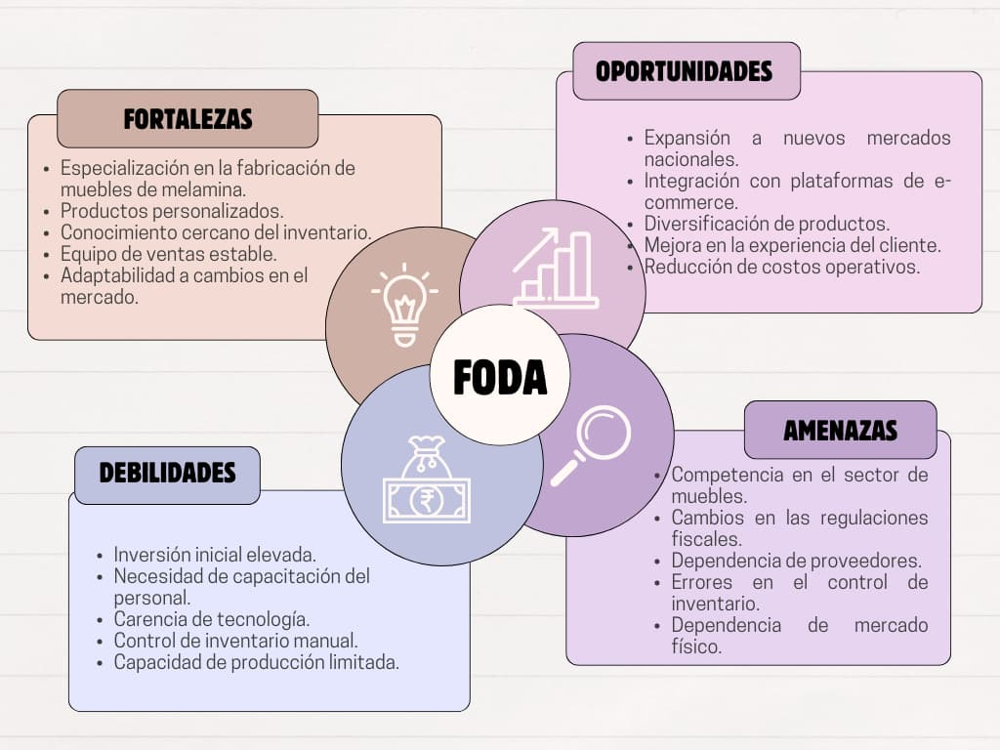

En el mundo empresarial actual, contar con sistemas de gestión eficientes es clave para el éxito de
cualquier organización, especialmente en sectores donde la optimización de procesos puede marcar la
diferencia entre cumplir con la demanda del mercado o perder oportunidades. Muebles Jhonny E.I.R.L.,
una empresa dedicada a la fabricación y venta de muebles de melamina, enfrenta desafíos significativos
en la gestión de su inventario, lo que afecta la planificación de la producción, el control de costos
y, en última instancia, la satisfacción de sus clientes.

Este post documenta el inicio del proyecto para desarrollar un sistema de gestión de inventario para
Muebles Jhonny, cuyo objetivo es mejorar la eficiencia operativa mediante la automatización y centralización
de sus procesos de inventario. A través de un enfoque estructurado basado en la metodología Scrum, se busca
crear una solución tecnológica que permita a la empresa gestionar de manera efectiva sus materias primas,
productos en proceso y productos terminados, reduciendo costos y mejorando la capacidad de respuesta ante los
cambios en la demanda.

# ENTRADAS

## Caso de negocio del proyecto

Sistema de gestión de inventario para la empresa MUEBLES JHONNY E.I.R.L. Esta empresa está encargada de
fabricación y venta de muebles de melamine en general

### Descripción general:

“Muebles Jhonny" ha sido un competidor clave en el mercado local de fabricación y venta de muebles de
melamina desde su creación en 2017. Con tres tiendas y un taller ubicados en el Parque Industrial de
Villa el Salvador, su operación ha crecido de manera constante en los últimos años. Sin embargo, la empresa
ha enfrentado dificultades para capitalizar las oportunidades que ofrece el marketing digital moderno, lo
que ha afectado su capacidad para atraer nuevos clientes y mantener la lealtad de los actuales. Este proyecto
propone la implementación de una estrategia integral de marketing digital que optimice su presencia en
línea, incremente el tráfico web y, en última instancia, aumente las ventas a través de una mayor
conversión de clientes potenciales.

### Misión:

Crear y diseñar muebles de calidad que transforman los hogares y espacios comerciales, enfocados en la
comodidad, la estética y durabilidad, para mejorar la vida de nuestros clientes.

### Visiónn:

Ser una empresa referente y líder en el sector de muebles de melamina a nivel nacional, reconocidos por
nuestra calidad, originalidad y compromiso con la satisfacción del cliente.

### 1.4 Definición del problema:

"Muebles Jhonny E.I.R.L." enfrenta desafíos en la gestión eficiente de su inventario, lo que afecta
directamente su capacidad para planificar la producción, controlar costos y satisfacer las demandas de
sus clientes. La falta de un sistema automatizado y centralizado para gestionar las materias primas,
productos en proceso y productos terminados resulta en ineficiencias como sobrecostos por exceso o
escasez de inventario, demoras en la producción y posibles pérdidas de ventas. Esto se agrava por la
necesidad de un seguimiento preciso de la cadena de suministro, la gestión de las órdenes de compra y
venta, y la necesidad de adaptarse a cambios en la demanda del mercado.

La empresa necesita una solución tecnológica que permita mejorar el control de inventarios, optimizar
la planificación de la producción, y ofrecer datos en tiempo real para la toma de decisiones estratégicas,
todo ello con el objetivo de incrementar la eficiencia operativa y mejorar la satisfacción del cliente

### 1.5 Propuesta:

Desarrollar un sistema de gestión de inventario que permita a "Muebles Jhonny E.I.R.L." Gestionar
eficientemente los materiales, productos en proceso y productos terminados, facilitando el control
de stock y la planificación de la producción

# HERRAMIENTAS

## Análisis FODA:

El análisis FODA es una herramienta estratégica que permite identificar las Fortalezas, Oportunidades,
Debilidades y Amenazas de un proyecto o empresa. En el caso de "Muebles Jhonny E.I.R.L.", el análisis
FODA es el siguiente:

# SALIDAS

El rol del Product Owner es fundamental en la gestión ágil de proyectos, especialmente en el marco de
trabajo Scrum, ya que es el principal responsable de maximizar el valor del producto que está siendo
desarrollado. El Product Owner no solo representa los intereses de la empresa, sino que también actúa
como el enlace entre los stakeholders y el equipo de desarrollo, asegurándose de que las prioridades
estén claras y alineadas con los objetivos del negocio.

## Product Owner Identificado:

Nombre: Asunción Pomasonco, Alexia Nicoll
