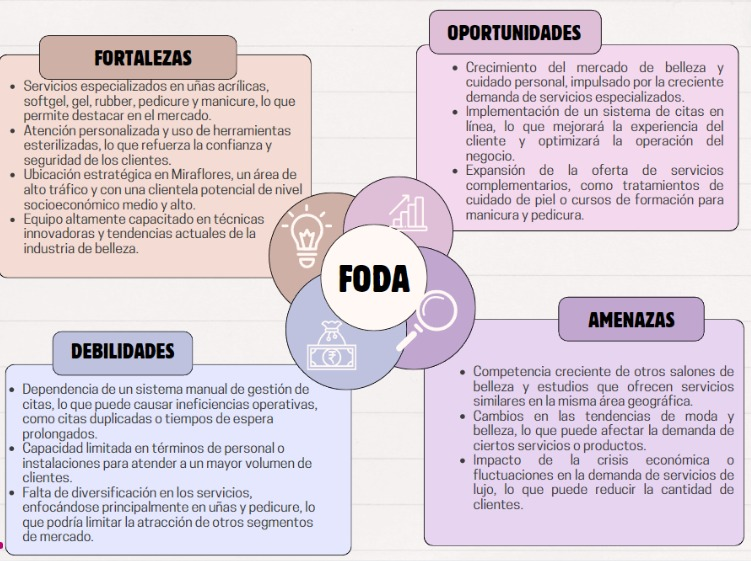

Este post documenta el inicio del proyecto para desarrollar un sistema de gestión de citas para LIENZO Estudio, cuyo
objetivo es mejorar la eficiencia operativa mediante la automatización y centralización de sus procesos de agendamiento.
A través de un enfoque estructurado basado en la metodología Scrum, se busca crear una solución tecnológica que permita al
salón gestionar de manera efectiva las reservas de citas y mejorar la capacidad de respuesta ante la demanda de los clientes.

# ENTRADAS

## Caso de negocio del proyecto

Implementación de un sistema de gestión de citas para LIENZO Estudio, que se especializa en uñas acrílicas, softgel, gel,
rubber, además de manicure.

### Descripción general

LIENZO Estudio, ubicado en Miraflores, Lima, ha ganado popularidad por su oferta de servicios especializados en el
cuidado y embellecimiento de uñas, así como en manicure. A pesar de su creciente clientela, la gestión de citas
se realiza de manera manual, lo que ha generado inconvenientes como el manejo ineficiente del tiempo de los clientes y del
personal. Este proyecto propone la implementación de un sistema de citas en línea que permita a los clientes reservar,
modificar o cancelar citas de manera autónoma, optimizando el tiempo de atención y reduciendo los errores en la asignación
de horarios. El objetivo es mejorar la experiencia del cliente y la eficiencia operativa del negocio.

	

### Misión

Brindar a nuestros clientes servicios de uñas acrílicas, softgel, gel, rubber y manicure de la más alta calidad, enfocándonos en la estética, el bienestar y la seguridad, utilizando productos y herramientas esterilizadas, en un ambiente cómodo y profesional.

### Visión

Posicionarse como un salón de belleza líder y ser reconocido por la calidad, innovación y profesionalismo en el cuidado de uñas y la atención integral de nuestros clientes, estableciendo un estándar de excelencia en la industria de la belleza.

### Definición del problema

Actualmente, _LIENZO_ Estudio enfrenta dificultades en la gestión de citas, lo que genera problemas como la sobrecarga de personal en ciertos momentos del día, citas duplicadas, y una falta de visibilidad en tiempo real de la disponibilidad. Estos inconvenientes afectan la satisfacción del cliente y la eficiencia en la operación del salón. Además, la falta de un sistema automatizado impide que los clientes puedan gestionar sus propias reservas, lo que deriva en demoras y una gestión deficiente del tiempo.

### Propuesta

Desarrollar un sistema de gestión de citas que permita a LIENZO Estudio ofrecer a sus clientes una plataforma en línea para reservar servicios de manera sencilla, proporcionando notificaciones, recordatorios automáticos y la capacidad de gestionar las citas según su disponibilidad. Esto mejorará la experiencia del cliente y la eficiencia del personal.

# HERRAMIENTAS

## Análisis FODA

El análisis FODA es una herramienta estratégica que permite identificar las Fortalezas, Oportunidades,
Debilidades y Amenazas de un proyecto o empresa. En el caso de LIENZO Estudio, el análisis
FODA es el siguiente:

# SALIDAS

## Product Owner Identificado: Tenorio Casiano Jhonny

El rol del Product Owner es fundamental en la gestión ágil de proyectos, especialmente en el marco de
trabajo Scrum, ya que es el principal responsable de maximizar el valor del producto que está siendo
desarrollado. El Product Owner no solo representa los intereses de la empresa, sino que también actúa
como el enlace entre los stakeholders y el equipo de desarrollo.

	

