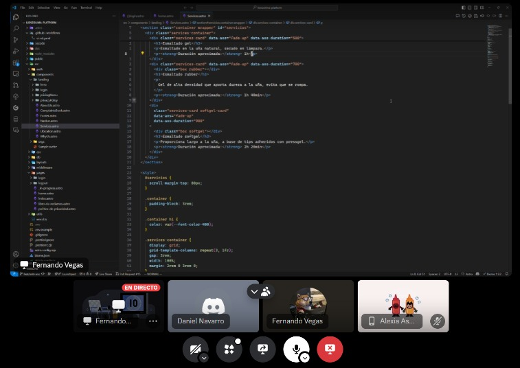

## ENTRADAS

### Equipo Principal de Scrum

- **Scrum Master:** Luque Cárdenas, Marjorie
- **Product Owner:** Tenorio Casiano, Jhonny
- **Equipo de desarrollo:**
  <ul style={{ listStyleType: "circle", paddingLeft: "20px" }}>
    <li>Vegas Villar, Fernando</li>
    <li>Asunción Pomasonco, Alexia Nicoll</li>
    <li>Navarro Tantalean, Daniel</li>
  </ul>
## Sprint Burndown Chart

## Impediment log

| **Impedimentos**                                                 |
|------------------------------------------------------------------|
| Conflictos entre miembros del equipo                              |
| Falta de disponibilidad de tiempo para organizarnos             |
| Exámenes parciales                                              |
| Falta de conocimientos para configurar el hosting                |
| Paro de transportistas                                           |

### HERRAMIENTAS
## Daily Standup

## Tres preguntas diarias
| **Pregunta**                | **Respuesta**                                                                                                           |
|-----------------------------|------------------------------------------------------------------------------------------------------------------------|
| **¿Qué hicimos ayer?**      | El día de ayer se finalizó con el procedimiento de login para el cliente; ahora este cliente podrá ingresar de manera correcta para posteriormente realizar su reserva de cita. |
| **¿Qué haremos hoy?**       | Hoy se procederá a refactorizar algunas variables del código y mejorar el diseño. Asimismo, se subirán los nuevos cambios en la rama principal del repositorio. |
| **¿Qué dificultades tuvimos?** | Se tuvo un poco de dificultad respecto a la integración de las tecnologías para el proceso de login del usuario.         |

### SALIDAS

## Sprint Burndown Chart actualizada

## Impediment Log

| **Impedimentos**                                                 |
|------------------------------------------------------------------|
| Conflictos entre miembros del equipo                              |
| Falta de disponibilidad de tiempo para organizarnos             |
| Exámenes parciales                                              |
| Falta de conocimientos para configurar el hosting                |
| Paro de transportistas                                           |