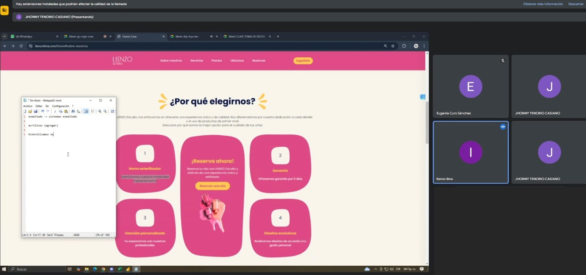

Las historias de usuario son descripciones simples y concisas de funcionalidades que deben desarrollarse desde la perspectiva del usuario, facilitando la comunicación entre los interesados y el equipo técnico. Estas historias ayudan a dividir el trabajo en pequeños incrementos manejables, que luego pueden priorizarse, planificarse y completarse dentro de cada sprint, asegurando una entrega constante de valor y un enfoque en los objetivos más importantes del proyecto.

## ENTRADAS

### Equipo Principal de Scrum

- **Scrum Master:** Luque Cárdenas, Marjorie
- **Product Owner:** Tenorio Casiano, Jhonny
- **Equipo de desarrollo:**
  <ul style={{ listStyleType: 'circle', paddingLeft: '20px' }}>
  	<li>Vegas Villar, Fernando</li>
  	<li>Asunción Pomasonco, Alexia Nicoll</li>
  	<li>Navarro Tantalean, Daniel</li>
  </ul>

### Backlog priorizado del producto

| ID  | Épicas priorizadas                 | Prioridad (MoSCoW) |
| --- | ---------------------------------- | ------------------ |
| 1   | Página de bienvenida               | Must Have          |
| 2   | Gestión de citas de clientes       | Must Have          |
| 3   | Gestión de contenido del sitio web | Should Have        |

### Criterios de terminado

- Funcionalidad de Login y Registro: Completo y probado para facilitar el acceso seguro y rápido de los usuarios.
- Redirección a Instagram para Reserva de Citas: Enlace accesible y funcional que permite la comunicación directa del usuario con la empresa en Instagram.
- Visor de Citas para el Administrador/Dueña: Herramienta de gestión eficiente de citas.
- Pruebas de Calidad (QA): Superación de todas las pruebas de carga, compatibilidad en dispositivos y navegadores, y optimización visual.
- Aprobación de Stakeholders: Revisión y validación final por parte de los stakeholders, garantizando que todas las expectativas están cumplidas.

### Prototipos

**Vanesa:** Es una chica alegre y proactiva de 22 años de edad, que le gusta ir de compras y realizarlo de forma rápida y eficiente. Suele ir de fiesta cada fin de semana a veces con sus compañeros de trabajo o de su universidad. Cuando va a realizarse la manicura, no le gusta que la reserva de cita sea lenta y haya muchas etapas para poder realizarla.

**Estefany:** Tiene 21 años de edad con residencia en Miraflores, es más reservada pero competente en sus actividades, suele ir a conferencias y congresos de su universidad cada vez que puede, es una mujer comprometida con su educación. Prefiere pagar con yape cualquier servicio o bien que compra, por eso se siente cómoda cuando hay este medio de pago disponible al momento de realizar cualquier pago.

**María:** Es muy perfeccionista en cuanto al trabajo se refiere, trata de dar su mayor esfuerzo para que todo salga bien, le molesta cuando siente que algo no está tan bien como ella quisiera. Cuando navega en línea no le gusta que las páginas demoren en cargar o se ponga lento.

**Elisabeth:** Es una persona indecisa cuando va de compras con 30 años de edad y con domicilio en San Borja, siempre busca las características y detalles de lo que desea llevar, en muchas ocasiones dichos objetos no cuentan con características claras o simplemente no existen. Por eso cuando navega en sitios web que realicen servicios, siempre le gusta cuando se detalla en qué consiste dicho servicio.

## HERRAMIENTAS

### Experiencia en la redacción de historias de usuario

## SALIDAS

### Historias de usuario

- Historia 1: Como usuario, quiero registrarme fácilmente a través de un formulario intuitivo o mi cuenta de Google, para agilizar el proceso de creación de cuenta.
- Historia 2: Como usuario, quiero hacer una reserva de cita a través de un enlace directo al chat de Instagram de la empresa, para confirmar rápidamente con la dueña.
- Historia 3: Como dueña, quiero tener un visor de citas para organizar mis servicios de manera eficiente, asimismo podré administrar mis recordatorios.
- Historia 4: Como dueña, quiero poder registrar la reserva de citas de mis clientes y poder agregar nuevos empleados a mi sistema.

### Criterios de aceptación de las historias de usuario

| **Historia**    | **Criterios de Aceptación**                                                                                                                                                                                                                                                                                                                                        |
| --------------- | ------------------------------------------------------------------------------------------------------------------------------------------------------------------------------------------------------------------------------------------------------------------------------------------------------------------------------------------------------------------ |
| **Historia 1:** | 1. El formulario permite registro por correo y contraseña, además de la opción de vinculación rápida con Google. 2. El proceso de registro con Google debe completarse en dos pasos o menos. 3. Una vez registrado, el usuario recibe confirmación visible de que el proceso ha sido exitoso y se le redirige a la página de inicio.                               |
| **Historia 2:** | 1. El enlace para reservar cita en Instagram debe estar ubicado de manera destacada en la página de inicio y ser claramente accesible. 2. Al hacer clic, el enlace se redirige correctamente al chat de Instagram de la empresa sin interrupciones. 3. La dueña puede registrar manualmente las citas en el sistema una vez confirmadas con el cliente en el chat. |
| **Historia 3:** | 1. El visor de citas debe mostrar claramente los detalles de cada cita. 2. El sistema permite al administrador ver las citas en tiempo real.                                                                                                                                                                                                                       |
| **Historia 4:** | 1. El sistema permite registrar mediante un formulario la cita del usuario. 2.Los empleados nuevos van a poder ser registrados de manera exitosa en el sistema por la dueña.                                                                                                                                                                                       |
