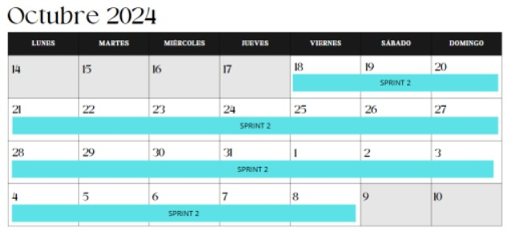
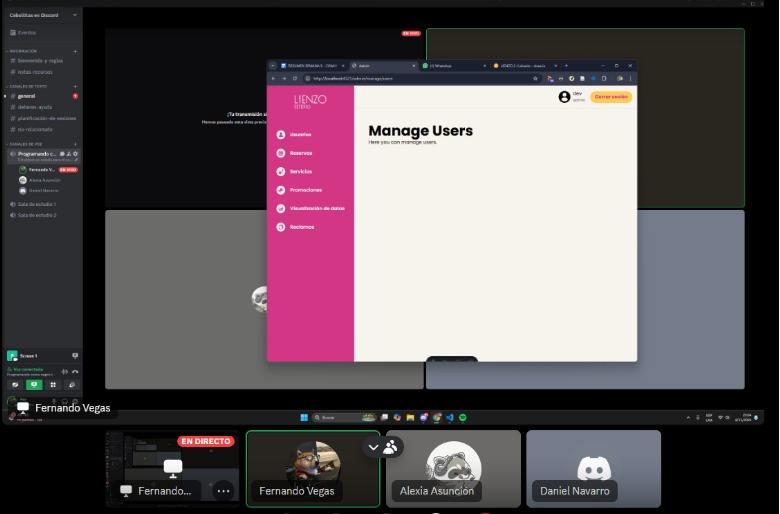

Comprometer historias de usuario en Scrum es esencial porque asegura que el equipo trabaje de manera organizada y alineada con los objetivos del negocio, al establecer expectativas claras sobre lo que se debe entregar durante el sprint. Este compromiso fomenta la responsabilidad y la rendición de cuentas dentro del equipo, lo que facilita una planificación realista basada en la capacidad del equipo y evita sobrecargas. Además, permite entregar valor de forma constante, centrando el esfuerzo en lo más prioritario y relevante para el cliente o negocio, lo que contribuye al éxito del proyecto.

## ENTRADAS

### Equipo Principal de Scrum

- _Scrum Master:_ Luque Cárdenas, Marjorie
- _Product Owner:_ Tenorio Casiano, Jhonny
- _Equipo de desarrollo:_
  <ul style={{ listStyleType: 'circle', paddingLeft: '20px' }}>
  	<li>Vegas Villar, Fernando</li>
  	<li>Asunción Pomasonco, Alexia Nicoll</li>
  	<li>Navarro Tantalean, Daniel</li>
  </ul>

### Historias de usuario estimadas

| **Historia de Usuario**                                                                                                                                                                                                        | **Valor Final** |
| ------------------------------------------------------------------------------------------------------------------------------------------------------------------------------------------------------------------------------ | --------------- |
| **Historia 1**: Como usuario, quiero registrarme fácilmente a través de un formulario intuitivo o mi cuenta de Google, porque deseo agilizar el proceso de creación de cuenta.                                                 | 3               |
| **Historia 2**: Como usuario, quiero hacer una reserva de cita a través de un enlace directo al chat de Instagram de la empresa, porque quiero confirmar rápidamente con la dueña.                                             | 1               |
| **Historia 3**: Cómo dueña, quiero tener un visor de citas para organizar mis servicios de manera eficiente, asimismo podré administrar mis recordatorios.                                                                     | 13              |
| **Historia 4**: Cómo dueña, quiero poder registrar la reserva de citas de mis clientes y poder agregar nuevos empleados a mi sistema,porque necesito gestionar eficientemente las citas y expandir el equipo según la demanda. | 5               |

### Duración del Sprint

El sprint tendrá una duración de 3 semanas

## HERRAMIENTAS

### Reunión de Sprint

## SALIDAS

### Historias de usuario comprometidas

- Historia 1: Como usuario, quiero registrarme fácilmente a través de un formulario intuitivo o mi cuenta de Google, para agilizar el proceso de creación de cuenta.
- Historia 2: Como usuario, quiero hacer una reserva de cita a través de un enlace directo al chat de Instagram de la empresa, para confirmar rápidamente con la dueña.
- Historia 3: Cómo dueña, quiero tener un visor de citas para organizar mis servicios de manera eficiente, asimismo podré administrar mis recordatorios.
- Historia 4: Cómo dueña, quiero poder registrar la reserva de citas de mis clientes y agregar nuevos empleados a mi sistema, porque necesito gestionar eficientemente las citas y expandir el equipo según la demanda.
