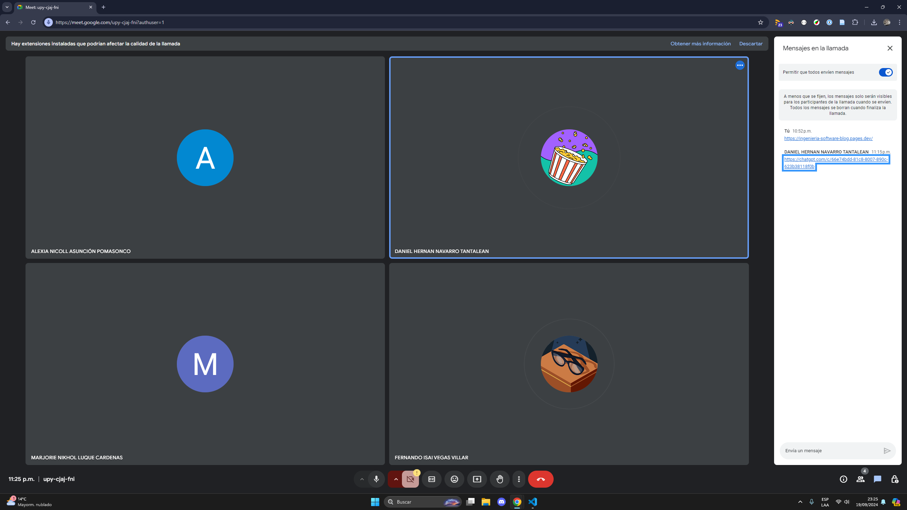

Formar un equipo Scrum sólido permite que todos los miembros trabajen en sintonía hacia
los objetivos del proyecto, siguiendo los principios ágiles de colaboración, autoorganización
y adaptación continua. Este proceso es esencial para asegurar que la solución tecnológica
propuesta cumpla con las necesidades del negocio y se entregue dentro de los plazos estipulados.
En este contexto, el Product Owner, el Scrum Master y los desarrolladores desempeñan roles
claves, ya que aseguran que el equipo tenga una visión clara de los requerimientos, pueda
superar los obstáculos que surjan y entregue incrementos de producto de manera continua.

Este post aborda la importancia de seleccionar a las personas adecuadas para formar el equipo
Scrum, considerando tanto sus habilidades técnicas como su compromiso con el proyecto. La
sinergia entre estos profesionales es un factor importante para asegurar que el sistema de gestión
de citas se desarrolle conforme a las expectativas y proporcione mejoras significativas
en la operación de LIENZO Estudio.

# ENTRADAS

## Product Owner

En este proyecto, el rol de Product Owner está a cargo de Jhonny Tenorio Casiano.
Él es responsable de maximizar el valor del producto y asegurar que el sistema de gestión
de citas cumpla con las expectativas de LIENZO Estudio y sus stakeholders.
Como representantes del negocio, trabajará estrechamente con el equipo Scrum para priorizar tareas y
asegurar que cada iteración del proyecto agregue valor significativo.

## Scrum Master

El puesto de Scrum Master lo ocupa Marjorie Luque Cárdenas, quien tiene la función de facilitar la
metodología Scrum dentro del equipo y asegurar que todos los miembros comprendan y apliquen los
principios ágiles. Su rol será clave para remover cualquier impedimento que pueda afectar la eficiencia
del equipo y mantener una cultura de autoorganización, comunicación constante y adaptación continua.

# HERRAMIENTAS

## Selección del equipo Scrum

Criterios para seleccionar a los miembros del equipo:

- Interfuncionalidad: Los miembros del equipo deben ser capaces de realizar una variedad de tareas. Esto asegura que el equipo pueda ser autosuficiente en todas las áreas necesarias para desarrollar el producto.
- Auto-organización: El equipo debe estar compuesto por personas que se gestionen a sí mismas y puedan coordinar sus propios esfuerzos sin la necesidad de una supervisión constante.
- Tamaño del equipo: De 5 miembros es el tamaño recomendado para un equipo Scrum efectivo.

## Selección del equipo de desarrollo

El equipo de desarrollo se debe formar a partir de una entrevista entre los postulantes, evaluando sus capacidades y
habilidades técnicas para poder llevar a cabo el desarrollo del producto (programación, diseño, pruebas, etc.), esto
generalmente lo realiza el Product Owner en compañía del Scrum Master.

# SALIDAS

# Equipo Scrum Identificado

### Scrum master: Luque Cardenas Marjorie

Responsable de asegurar que el equipo siga las prácticas de Scrum, facilitando las ceremonias, eliminando impedimentos y ayudando a mejorar la eficiencia y la autoorganización del equipo. Marjorie se encargará también de mantener la comunicación fluida entre el equipo de desarrollo y los stakeholders, asegurando que el equipo trabaje en un ambiente propicio para completar el proyecto exitosamente.

### Product Owner: Tenorio Casiano Jhonny

Encargado de representar los intereses del cliente o usuarios finales. Jhonny es responsable de crear y priorizar el Backlog del Producto, definir claramente los requisitos y criterios de aceptación, y asegurar que el equipo esté trabajando en los ítems de mayor valor para el proyecto. Interactúa constantemente con los stakeholders para verificar que se cumplan las expectativas del cliente.

### Equipo de desarrollo:

- Vegas Villar Fernando

Frontend developer, responsable de diseñar y desarrollar la interfaz de usuario. Fernando estará enfocado en garantizar que los entregables visuales cumplan con los estándares de usabilidad y rendimiento.

- Asuncion Pomasonco Alexia Nicoll

Backend developer, encargado del desarrollo de la lógica del servidor y la integración con bases de datos. Se asegurará de que las funcionalidades internas del producto sean eficientes y cumplan con los requisitos de seguridad.

- Navarro Tantalean Daniel

QA tester, encargado de realizar pruebas para asegurar que cada incremento del producto cumpla con los criterios de calidad. Daniel ejecutará pruebas automatizadas y manuales para identificar y corregir defectos antes de la entrega final.
