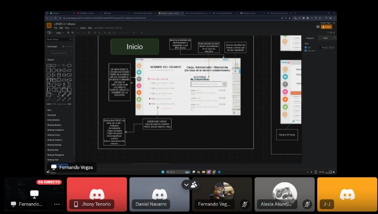

Una vez que el equipo se compromete a completar ciertas historias durante un sprint, es necesario dividirlas en tareas más pequeñas para facilitar la planificación, la asignación de responsabilidades y el seguimiento del progreso. Esta identificación permite al equipo trabajar de manera organizada y eficiente, asegurando que todos los miembros sepan exactamente qué deben hacer para alcanzar los objetivos del sprint y entregar valor al cliente dentro del tiempo establecido.

## ENTRADAS

### Equipo Principal de Scrum

- **Scrum Master:** Luque Cárdenas, Marjorie
- **Product Owner:** Tenorio Casiano, Jhonny
- **Equipo de desarrollo:**
  <ul style={{ listStyleType: 'circle', paddingLeft: '20px' }}>
  	<li>Vegas Villar, Fernando</li>
  	<li>Asunción Pomasonco, Alexia Nicoll</li>
  	<li>Navarro Tantalean, Daniel</li>
  </ul>

### Historias de usuario comprometidas

- Historia 1: Como usuario, quiero registrarme fácilmente a través de un formulario intuitivo o mi cuenta de Google, para agilizar el proceso de creación de cuenta.
- Historia 2: Como usuario, quiero hacer una reserva de cita a través de un enlace directo al chat de Instagram de la empresa, para confirmar rápidamente con la dueña.
- Historia 3: Como dueña, quiero tener un visor de citas para organizar mis servicios de manera eficiente, asimismo podré administrar mis recordatorios.
- Historia 4: Como dueña, quiero poder registrar la reserva de citas de mis clientes y agregar nuevos empleados a mi sistema, porque necesito gestionar eficientemente las citas y expandir el equipo según la demanda

## HERRAMIENTAS

### Reunión del Sprint

En esta reunión, el equipo Scrum, junto con el Product Owner, define qué historias de usuario o elementos del backlog se priorizarán y se comprometen a completarlas dentro del sprint. El equipo también desglosa estas historias en tareas más pequeñas, asigna responsabilidades y estima el esfuerzo necesario.

## SALIDAS

### Lista de tareas

#### Historia 1: Como usuario, quiero registrarme fácilmente a través de un formulario intuitivo o mi cuenta de Google, para agilizar el proceso de creación de cuenta.

#### Tareas:

- **Tarea 1.1:** Diseñar la interfaz del formulario de registro, incluyendo opciones de registro por correo y Google.
- **Tarea 1.2:** Configurar la base de datos para almacenar la información de los usuarios de manera segura.
- **Tarea 1.3:** Implementar la funcionalidad de registro con correo y contraseña, asegurando una experiencia de usuario adecuada.
- **Tarea 1.4:** Configurar la autenticación con Google utilizando OAuth2 para facilitar el registro de los usuarios que prefieren esta opción.

#### Historia 2: Como usuario, quiero hacer una reserva de cita a través de un enlace directo al chat de Instagram de la empresa, para confirmar rápidamente con la dueña.

#### Tareas:

- **Tarea 2.1:** Crear el diseño de la sección de reserva con un botón de enlace claro que redirija al chat de Instagram.
- **Tarea 2.2:** Implementar el enlace al chat de Instagram en la página, verificando que la redirección sea rápida y segura.

#### Historia 3: Como dueña, quiero tener un visor de citas para organizar mis servicios de manera eficiente, asimismo podré administrar mis recordatorios.

#### Tareas:

- **Tarea 3.1:** Diseñar la interfaz del visor de citas, permitiendo la visualización de cada cita.
- **Tarea 3.2:** Implementar la funcionalidad de administrar mis recordatorios en tiempo real.

#### Historia 4: Como dueña, quiero poder registrar la reserva de citas de mis clientes y agregar nuevos empleados a mi sistema, porque necesito gestionar eficientemente las citas y expandir el equipo según la demanda.

- **Tarea 4.1:** Diseñar la interfaz para el registro de reservas de citas y gestión de empleados.
- **Tarea 4.2:** Implementar la funcionalidad de registro de citas y empleados en el sistema, permitiendo que los datos se guarden correctamente y sean accesibles.
- **Tarea 4.3:** Desarrollar la funcionalidad para asignar citas a empleados específicos.
