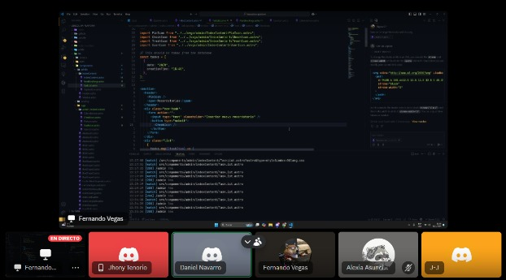

El Sprint Backlog es una lista de elementos seleccionados del Product Backlog que el equipo se compromete a completar en el ciclo de trabajo actual.
Este backlog actúa como una hoja de ruta para el sprint, proporcionando claridad sobre los objetivos del equipo y asegurando un enfoque constante en la entrega de valor al cliente.

## ENTRADAS

### Equipo Principal de Scrum

- **Scrum Master:** Luque Cárdenas, Marjorie
- **Product Owner:** Tenorio Casiano, Jhonny
- **Equipo de desarrollo:**
  <ul style={{ listStyleType: 'circle', paddingLeft: '20px' }}>
  	<li>Vegas Villar, Fernando</li>
  	<li>Asunción Pomasonco, Alexia Nicoll</li>
  	<li>Navarro Tantalean, Daniel</li>
  </ul>

### Effort Estimated Task List

| **Historia** | **Tarea**                                                                                                                                                         | **Esfuerzo (Horas)** |
| ------------ | ----------------------------------------------------------------------------------------------------------------------------------------------------------------- | -------------------- |
| Historia 1   | **Tarea 1.1**: Diseñar la interfaz del formulario de registro, incluyendo opciones de registro por correo y Google.                                               | 5                    |
| Historia 1   | **Tarea 1.2**: Configurar la base de datos para almacenar la información de los usuarios de manera segura.                                                        | 3                    |
| Historia 1   | **Tarea 1.3**: Implementar la funcionalidad de registro con correo y contraseña, asegurando una experiencia de usuario adecuada.                                  | 5                    |
| Historia 1   | **Tarea 1.4**: Configurar la autenticación con Google utilizando OAuth2 para facilitar el registro de los usuarios.                                               | 8                    |
| Historia 2   | **Tarea 2.1**: Crear el diseño de la sección de reserva con un botón de enlace claro que redirija al chat de Instagram.                                           | 3                    |
| Historia 2   | **Tarea 2.2**: Implementar el enlace al chat de Instagram en la página, verificando que la redirección sea rápida y segura.                                       | 3                    |
| Historia 3   | **Tarea 3.1**: Diseñar e implementar la interfaz del visor de citas, permitiendo la visualización de cada cita.                                                   | 8                    |
| Historia 3   | **Tarea 3.2**: Implementar la funcionalidad de administrar mis recordatorios en tiempo real.                                                                      | 8                    |
| Historia 4   | **Tarea 4.1**: Diseñar la interfaz para el registro de reservas de citas y gestión de empleados.                                                                  | 5                    |
| Historia 4   | **Tarea 4.2**: Implementar la funcionalidad de registro de citas y empleados en el sistema, permitiendo que los datos se guarden correctamente y sean accesibles. | 8                    |
| Historia 4   | **Tarea 4.3**: Desarrollar la funcionalidad para asignar citas a empleados específicos.                                                                           | 8                    |

## HERRAMIENTAS

### Reunión del Sprint

Reunión de planificación Sprint

## SALIDAS

### Sprint Backlog

| **Historia** | **Tarea**                                                                                                                                                         | **Esfuerzo (Horas)** | **Responsable** | **Prioridad** |
| ------------ | ----------------------------------------------------------------------------------------------------------------------------------------------------------------- | -------------------- | --------------- | ------------- |
| Historia 1   | **Tarea 1.1**: Diseñar la interfaz del formulario de registro, incluyendo opciones de registro por correo y Google.                                               | 5                    | Fernando        | Alta          |
| Historia 1   | **Tarea 1.2**: Configurar la base de datos para almacenar la información de los usuarios de manera segura.                                                        | 3                    | Fernando        | Alta          |
| Historia 1   | **Tarea 1.3**: Implementar la funcionalidad de registro con correo y contraseña, asegurando una experiencia de usuario adecuada.                                  | 5                    | Fernando        | Media         |
| Historia 1   | **Tarea 1.4**: Configurar la autenticación con Google utilizando OAuth2 para facilitar el registro de los usuarios.                                               | 5                    | Daniel          | Alta          |
| Historia 2   | **Tarea 2.1**: Crear el diseño de la sección de reserva con un botón de enlace claro que redirija al chat de Instagram.                                           | 3                    | Fernando        | Media         |
| Historia 2   | **Tarea 2.2**: Implementar el enlace al chat de Instagram en la página, verificando que la redirección sea rápida y segura.                                       | 5                    | Alexia          | Media         |
| Historia 3   | **Tarea 3.1**: Diseñar e implementar la interfaz del visor de citas, permitiendo la visualización de cada cita.                                                   | 8                    | Alexia          | Alta          |
| Historia 3   | **Tarea 3.2**: Implementar la funcionalidad de administrar mis recordatorios en tiempo real.                                                                      | 8                    | Fernando        | Alta          |
| Historia 4   | **Tarea 4.1**: Diseñar la interfaz para el registro de reservas de citas y gestión de empleados.                                                                  | 5                    | Fernando        | Media         |
| Historia 4   | **Tarea 4.2**: Implementar la funcionalidad de registro de citas y empleados en el sistema, permitiendo que los datos se guarden correctamente y sean accesibles. | 8                    | Daniel          | Alta          |
| Historia 4   | **Tarea 4.3**: Desarrollar la funcionalidad para asignar citas a empleados específicos.                                                                           | 8                    | Alexia          | Alta          |
