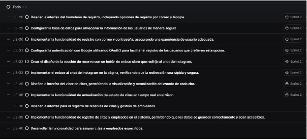
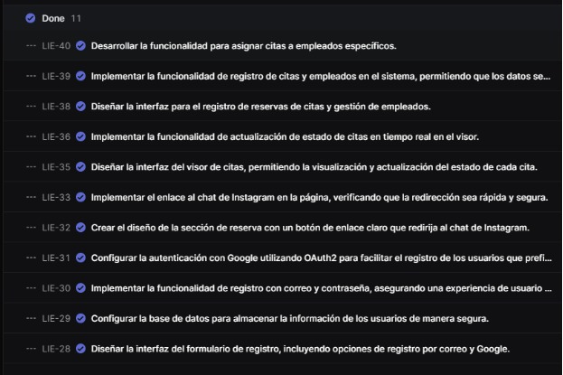

## ENTRADAS

### Equipo Principal de Scrum

- **Scrum Master:** Luque Cárdenas, Marjorie
- **Product Owner:** Tenorio Casiano, Jhonny
- **Equipo de desarrollo:**
  <ul style={{ listStyleType: 'circle', paddingLeft: '20px' }}>
  	<li>Vegas Villar, Fernando</li>
  	<li>Asunción Pomasonco, Alexia Nicoll</li>
  	<li>Navarro Tantalean, Daniel</li>
  </ul>

### Sprint Backlog

| **Historia** | **Tarea**                                                                                                                   | **Esfuerzo** | **Responsable** | **Prioridad** |
|--------------|-----------------------------------------------------------------------------------------------------------------------------|--------------|-----------------|---------------|
| Historia 1   | Tarea 1.1: Diseñar la interfaz del formulario de registro, incluyendo opciones de registro por correo y Google.             | 5            | Fernando        | Alta          |
| Historia 1   | Tarea 1.2: Configurar la base de datos para almacenar la información de los usuarios de manera segura.                      | 3            | Fernando        | Alta          |
| Historia 1   | Tarea 1.3: Implementar la funcionalidad de registro con correo y contraseña, asegurando una experiencia de usuario adecuada. | 5            | Fernando        | Media         |
| Historia 1   | Tarea 1.4: Configurar la autenticación con Google utilizando OAuth2 para facilitar el registro de los usuarios.             | 5            | Daniel          | Alta          |
| Historia 2   | Tarea 2.1: Crear el diseño de la sección de reserva con un botón de enlace claro que redirija al chat de Instagram.         | 3            | Fernando        | Media         |
| Historia 2   | Tarea 2.2: Implementar el enlace al chat de Instagram en la página, verificando que la redirección sea rápida y segura.     | 5            | Alexia          | Media         |
| Historia 3   | Tarea 3.1: Diseñar la interfaz del visor de citas, permitiendo la visualización y actualización del estado de cada cita.    | 8            | Alexia          | Alta          |
| Historia 3   | Tarea 3.2: Implementar la funcionalidad de actualización de estado de citas en tiempo real en el visor.                     | 8            | Fernando        | Alta          |
| Historia 4   | Tarea 4.1: Diseñar la interfaz para el registro de reservas de citas y gestión de empleados.                                | 5            | Fernando        | Media         |
| Historia 4   | Tarea 4.2: Implementar la funcionalidad de registro de citas y empleados en el sistema, permitiendo que los datos se guarden correctamente y sean accesibles. | 8            | Daniel          | Alta          |
| Historia 4   | Tarea 4.3: Desarrollar la funcionalidad para asignar citas a empleados específicos.                                         | 8            | Alexia          | Alta          |

### SCRUMBOARD

### IMPEDIMENT LOG

| Conflictos entre miembros del equipo              |
| ------------------------------------------------- |
| Falta de tiempo por parte del equipo                |
| Problemas al coordinar los diseños necesarios para este sprint                                |
| Problemas al coordinar el flujo necesario para el registro de citas |

## HERRAMIENTAS

### Experiencia de Equipo

El cliente, al recibir actualizaciones regulares del Product Owner, ha desarrollado una confianza creciente en el avance y calidad del proyecto. Durante las reuniones de seguimiento, el Product Owner ha demostrado cómo el equipo de desarrollo, guiado por el Scrum Master, trabaja de manera organizada y eficiente en funciones clave como el registro seguro de usuarios, la autenticación con opciones avanzadas y la integración con redes sociales. Cada miembro del equipo ha asumido sus tareas con responsabilidad, mostrando adaptabilidad para resolver desafíos técnicos como la implementación de autenticación mediante OAuth2 y los ajustes en la gestión de citas. La coordinación constante entre el Product Owner, el Scrum Master y el equipo de desarrollo ha sido fundamental para mantener la comunicación fluida y abordar rápidamente cualquier obstáculo. Este nivel de organización y dedicación permite al cliente percibir que el proyecto avanza conforme a los objetivos, reforzando su confianza en la entrega oportuna y la calidad del producto final.
## SALIDAS

### Entregables del Sprint

El equipo ha completado exitosamente todas las tareas programadas en el sprint backlog, logrando los objetivos planteados para el proyecto. Entre los entregables se encuentran el diseño y la implementación de la interfaz del formulario de registro, que incluye opciones de registro por correo y autenticación mediante Google, brindando flexibilidad y seguridad a los usuarios. La configuración de la base de datos también se ha realizado, garantizando el almacenamiento seguro de la información de los usuarios, así como la funcionalidad de registro.
Además, se ha diseñado e implementado la sección de reservas con un botón de enlace que permite la redirección rápida al chat de Instagram, y se creó una guía para la dueña sobre cómo registrar manualmente citas desde Instagram en el sistema. Finalmente, se desarrolló el visor de citas con una interfaz intuitiva que permite visualizar y actualizar el estado de cada cita en tiempo real. Una notificación visual también fue implementada para alertar sobre citas próximas, facilitando la gestión del tiempo. Estos entregables garantizan una experiencia robusta y fluida, cumpliendo con los requisitos de funcionalidad y usabilidad establecidos

[Visita el sitio aquí](https://lienzolima.com/home)

### SCRUMBOARD ACTUALIZADO

