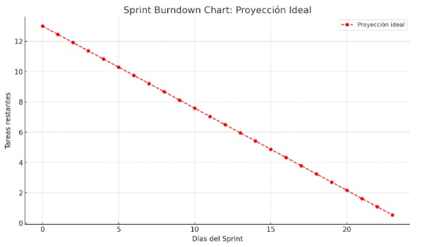
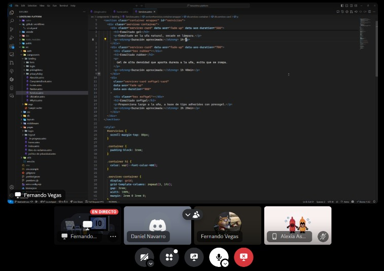
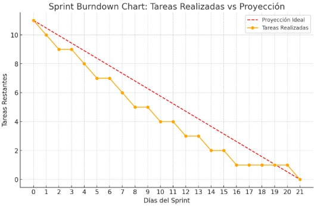

## ENTRADAS

### Equipo Principal de Scrum

- **Scrum Master:** Luque Cárdenas, Marjorie
- **Product Owner:** Tenorio Casiano, Jhonny
- **Equipo de desarrollo:**
  <ul style={{ listStyleType: 'circle', paddingLeft: '20px' }}>
  	<li>Vegas Villar, Fernando</li>
  	<li>Asunción Pomasonco, Alexia Nicoll</li>
  	<li>Navarro Tantalean, Daniel</li>
  </ul>

### Sprint Burndown Chart

### Impediment log

| **Impedimentos**                                    |
| --------------------------------------------------- |
| Falta de tiempo por parte del equipo              |
| Problemas al coordinar los diseños necesarios para este sprint |
| Problemas al coordinar el flujo necesario para el registro de citas |

## HERRAMIENTAS

### Daily Standup

### Tres preguntas diarias

| **Pregunta**                   | **Respuesta**                                                                                                                                                                   |
| ------------------------------ | ------------------------------------------------------------------------------------------------------------------------------------------------------------------------------- |
| **¿Qué hicimos ayer?**         | Se completó el diseño de la sección de reserva, incluyendo un botón de enlace claro que redirige al chat de Instagram para que los clientes puedan hacer sus consultas y reservas fácilmente. |
| **¿Qué haremos hoy?**          | Hoy implementaremos el enlace al chat de Instagram en la página, verificando que la redirección sea rápida y segura para los usuarios.                 |
| **¿Qué dificultades tuvimos?** | Tuvimos problemas menores al probar el enlace en diferentes dispositivos y navegadores.|

## SALIDAS

### Sprint Burndown Chart actualizada

### Impediment Log

| **Impedimentos**                                    |
| --------------------------------------------------- |
| Falta de tiempo por parte del equipo                |
| Problemas al coordinar los diseños necesarios para este sprint |
| Problemas al coordinar el flujo necesario para el registro de citas                                  |

