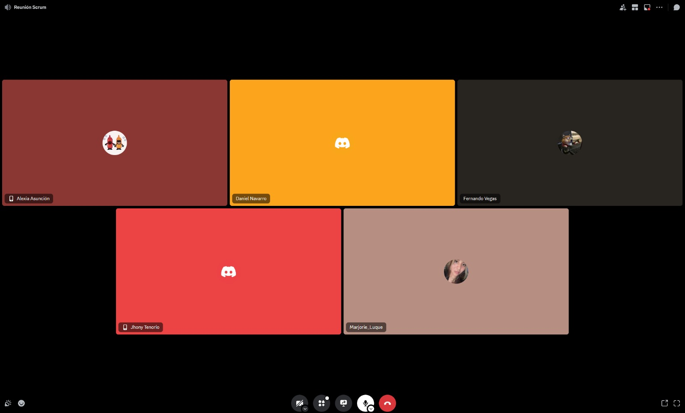

## ENTRADAS

### Equipo Principal de Scrum

- **Scrum Master:** Luque Cárdenas, Marjorie
- **Product Owner:** Tenorio Casiano, Jhonny
- **Equipo de desarrollo:**
  <ul style="list-style-type: circle; padding-left: 20px;">
    <li>Vegas Villar, Fernando</li>
    <li>Asunción Pomasonco, Alexia Nicoll</li>
    <li>Navarro Tantalean, Daniel</li>
  </ul>

### ENTREGABLES DEL SPRINT

| **Historia de Usuario**                                                                                                   | **Criterios de aceptación/Entregables**                                                                                                                                                 |
|---------------------------------------------------------------------------------------------------------------------------|------------------------------------------------------------------------------------------------------------------------------------------------------------------------------------------|
| Historia 1: Como usuario, quiero registrarme fácilmente a través de un formulario intuitivo o mi cuenta de Google, para agilizar el proceso de creación de cuenta. | 1. El formulario permite registrar por correo y contraseña, además de la opción de vinculación rápida con Google.  2. El proceso de registro con Google debe completarse en dos pasos o menos. 3. Una vez registrado, el usuario recibe confirmación visible de que el proceso ha sido exitoso y se le redirige a la página de inicio. |
| Historia 2: Como usuario, quiero hacer una reserva de cita a través de un enlace directo al chat de Instagram de la empresa, para confirmar rápidamente con la dueña. | 1. El enlace para reservar cita en Instagram debe estar ubicado de manera destacada en la página de inicio y ser claramente accesible.  2. Al hacer clic, el enlace se redirige correctamente al chat de Instagram de la empresa sin interrupciones. |
| Historia 3: Como dueña, quiero tener un visor de las citas pendientes y confirmadas, para organizar mis servicios de manera eficiente y asegurar una buena atención al cliente. | 1. El visor de citas debe mostrar claramente el estado de cada cita (pendiente o confirmada).  2. El sistema permite al administrador actualizar el estado de las citas en tiempo real. |
| Historia 4: Como dueña, quiero poder registrar la reserva de citas de mis clientes y agregar nuevos empleados a mi sistema, porque necesito gestionar eficientemente las citas y expandir el equipo según la demanda. | 1. El sistema permite registrar mediante un formulario la cita del usuario.  2. Los empleados nuevos van a poder ser registrados de manera exitosa en el sistema por la dueña. |

### SPRINT BACKLOG

| **Historia** | **Tarea**                                                                                                                   | **Esfuerzo** | **Responsable** | **Prioridad** |
|--------------|-----------------------------------------------------------------------------------------------------------------------------|--------------|-----------------|---------------|
| Historia 1   | Tarea 1.1: Diseñar la interfaz del formulario de registro, incluyendo opciones de registro por correo y Google.             | 5            | Fernando        | Alta          |
| Historia 1   | Tarea 1.2: Configurar la base de datos para almacenar la información de los usuarios de manera segura.                      | 3            | Fernando        | Alta          |
| Historia 1   | Tarea 1.3: Implementar la funcionalidad de registro con correo y contraseña, asegurando una experiencia de usuario adecuada. | 5            | Fernando        | Media         |
| Historia 1   | Tarea 1.4: Configurar la autenticación con Google utilizando OAuth2 para facilitar el registro de los usuarios.             | 5            | Daniel          | Alta          |
| Historia 2   | Tarea 2.1: Crear el diseño de la sección de reserva con un botón de enlace claro que redirija al chat de Instagram.         | 3            | Fernando        | Media         |
| Historia 2   | Tarea 2.2: Implementar el enlace al chat de Instagram en la página, verificando que la redirección sea rápida y segura.     | 5            | Alexia          | Media         |
| Historia 3   | Tarea 3.1: Diseñar la interfaz del visor de citas, permitiendo la visualización y actualización del estado de cada cita.    | 8            | Alexia          | Alta          |
| Historia 3   | Tarea 3.2: Implementar la funcionalidad de actualización de estado de citas en tiempo real en el visor.                     | 8            | Fernando        | Alta          |
| Historia 4   | Tarea 4.1: Diseñar la interfaz para el registro de reservas de citas y gestión de empleados.                                | 5            | Fernando        | Media         |
| Historia 4   | Tarea 4.2: Implementar la funcionalidad de registro de citas y empleados en el sistema, permitiendo que los datos se guarden correctamente y sean accesibles. | 8            | Daniel          | Alta          |
| Historia 4   | Tarea 4.3: Desarrollar la funcionalidad para asignar citas a empleados específicos.                                         | 8            | Alexia          | Alta          |

### Criterios de Terminado

- Funcionalidad de Login y Registro: Completo y probado para facilitar el acceso seguro y rápido de los usuarios.
- Redirección a Instagram para Reserva de Citas: Enlace accesible y funcional que permite la comunicación directa del usuario con la empresa en Instagram.
- Visor de Citas para el Administrador/Dueña: Herramienta de gestión eficiente para revisar y actualizar el estado de citas pendientes y confirmadas.
- Pruebas de Calidad (QA): Superación de todas las pruebas de carga, compatibilidad en dispositivos y navegadores, y optimización visual.
- Aprobación de Stakeholders: Revisión y validación final por parte de los stakeholders, garantizando que todas las expectativas están cumplidas.

### Criterios de Aceptación

#### Historia 1

- El formulario permite registrar por correo y contraseña, además de la opción de vinculación rápida con Google.
- El proceso de registro con Google debe completarse en dos pasos o menos.
- Una vez registrado, el usuario recibe confirmación visible de que el proceso ha sido exitoso y se le redirige a la página de inicio.

#### Historia 2

- El enlace para reservar cita en Instagram debe estar ubicado de manera destacada en la página de inicio y ser claramente accesible.
- Al hacer clic, el enlace se redirige correctamente al chat de Instagram de la empresa sin interrupciones.
- La dueña puede registrar manualmente las citas en el sistema una vez confirmadas con el cliente en el chat.

#### Historia 3

- El visor de citas debe mostrar claramente el estado de cada cita (pendiente o confirmada).
- El sistema permite al administrador actualizar el estado de las citas en tiempo real.

#### Historia 4

- El sistema permite registrar mediante un formulario la cita del usuario.
- Los empleados nuevos van a poder ser registrados de manera exitosa en el sistema por la dueña.

## HERRAMIENTAS

### REUNIÓN DE REVISIÓN DEL SPRINT

## SALIDAS

### Entregables Aceptados

| **Historia de Usuario** | **Criterios de Aceptación / Entregables**                                                                                                                                                                                                                 | **Aceptado** | **Rechazado** |
| ----------------------- | --------------------------------------------------------------------------------------------------------------------------------------------------------------------------------------------------------------------------------------------------------- | ------------ | ------------- |
| Historia 1              | Como usuario, quiero registrarme fácilmente a través de un formulario intuitivo o mi cuenta de Google, para agilizar el proceso de creación de cuenta.                                                                                                    | [X]          | [ ]           |
|                         | 1. El formulario permite registrar por correo y contraseña, además de la opción de vinculación rápida con Google.                                                                                                                                         |              |               |
|                         | 2. El proceso de registro con Google debe completarse en dos pasos o menos.                                                                                                                                                                               |              |               |
|                         | 3. Una vez registrado, el usuario recibe confirmación visible de que el proceso ha sido exitoso y se le redirige a la página de inicio.                                                                                                                   |              |               |
| Historia 2              | Como usuario, quiero hacer una reserva de cita a través de un enlace directo al chat de Instagram de la empresa, para confirmar rápidamente con la dueña.                                                                                                 | [X]          | [ ]           |
|                         | 1. El enlace para reservar cita en Instagram debe estar ubicado de manera destacada en la página de inicio y ser claramente accesible.                                                                                                                    |              |               |
|                         | 2. Al hacer clic, el enlace se redirige correctamente al chat de Instagram de la empresa sin interrupciones.                                                                                                                                              |              |               |
|                         | 3. La dueña puede registrar manualmente las citas en el sistema una vez confirmadas con el cliente en el chat.                                                                                                                                            |              |               |
| Historia 3              | Como dueña, quiero tener un visor de las citas pendientes y confirmadas, para organizar mis servicios de manera eficiente y asegurar una buena atención al cliente.                                                                                       | [X]          | [ ]           |
|                         | 1. El visor de citas debe mostrar claramente el estado de cada cita (pendiente o confirmada).                                                                                                                                                            |              |               |
|                         | 2. El sistema permite al administrador actualizar el estado de las citas en tiempo real.                                                                                                                                                                 |              |               |
| Historia 4              | Como dueña, quiero poder registrar la reserva de citas de mis clientes y agregar nuevos empleados a mi sistema, porque necesito gestionar eficientemente las citas y expandir el equipo según la demanda. | [X]          | [ ]           |
|                         | 1. El sistema permite registrar mediante un formulario la cita del usuario.                                                                                                                                                                             |              |               |
|                         | 2. Los empleados nuevos van a poder ser registrados de manera exitosa en el sistema por la dueña.                                                                                                                                                          |              |               |
