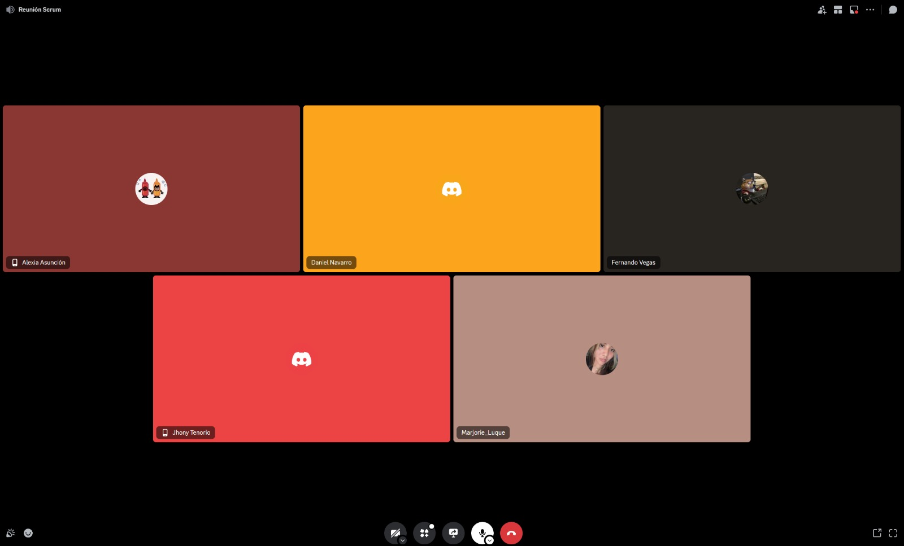

## ENTRADAS

### SALIDAS DE DEMOSTRAR Y VALIDAR EL SPRINT

| **Historia de Usuario**                       | **Criterios de Aceptación / Entregables**                                                                                                                                                                     | **Aceptado** | **Rechazado** |
| --------------------------------------------- | ------------------------------------------------------------------------------------------------------------------------------------------------------------------------------------------------------------- | ------------ | ------------- |
| **Historia 1: Registro de Usuario**           | **Como usuario**, quiero registrarme fácilmente a través de un formulario intuitivo o mi cuenta de Google, para agilizar el proceso de creación de cuenta.                                                    |              | x             |
|                                               | 1. El formulario permite registrar por correo y contraseña, además de la opción de vinculación rápida con Google.                                                                                             |              |               |
|                                               | 2. El proceso de registro con Google debe completarse en dos pasos o menos.                                                                                                                                   |              |               |
|                                               | 3. Una vez registrado, el usuario recibe confirmación visible de que el proceso ha sido exitoso y se le redirige a la página de inicio.                                                                       |              |               |
| **Historia 2: Reserva de Cita**               | **Como usuario**, quiero hacer una reserva de cita a través de un enlace directo al chat de Instagram de la empresa, para confirmar rápidamente con la dueña.                                                 |              | x             |
|                                               | 1. El enlace para reservar cita en Instagram debe estar ubicado de manera destacada en la página de inicio y ser claramente accesible.                                                                        |              |               |
|                                               | 2. Al hacer clic, el enlace se redirige correctamente al chat de Instagram de la empresa sin interrupciones.                                                                                                  |              |               |
|                                               | 3. La dueña puede registrar manualmente las citas en el sistema una vez confirmadas con el cliente en el chat.                                                                                                |              |               |
| **Historia 3: Visor de Citas**                | **Como dueña**, quiero tener un visor de citas para organizar mis servicios de manera eficiente, asimismo podré administrar mis recordatorios.                                                                |              | x             |
|                                               | 1. Diseñar e implementar la interfaz del visor de citas, permitiendo la visualización de cada cita.                                                                                                           |              |               |
|                                               | 2. Implementar la funcionalidad de administrar mis recordatorios en tiempo real.                                                                                                                              |              |               |
| **Historia 4: Registro de Citas y Empleados** | **Como dueña**, quiero poder registrar la reserva de citas de mis clientes y agregar nuevos empleados a mi sistema, porque necesito gestionar eficientemente las citas y expandir el equipo según la demanda. |              | x             |
|                                               | 1. El sistema permite registrar mediante un formulario la cita del usuario.                                                                                                                                   |              |               |
|                                               | 2. Los empleados nuevos van a poder ser registrados de manera exitosa en el sistema por la dueña.                                                                                                             |              |               |

## HERRAMIENTAS

### Reunión de Retrospectiva del Sprint

## SALIDAS

### Agreed Actionable Improvements

| **Categoría**   | **Acción**                                                                                                               | **Responsable**   |
| --------------- | ------------------------------------------------------------------------------------------------------------------------ | ----------------- |
| Empezar a hacer | Configurar el flujo de registro con Google de manera que se complete en dos pasos o menos para mayor eficiencia.         | Fernando y Daniel |
| Empezar a hacer | Proporcionar una confirmación visual al usuario tras el registro y redirigirlo a la página de inicio.                    | Fernando          |
| Seguir haciendo | Mantener el enlace de reserva de citas en Instagram en una ubicación destacada en la página de inicio para fácil acceso. | Alexia            |
| Seguir haciendo | Continuar verificando que el enlace de reserva dirija correctamente al chat de Instagram sin interrupciones.             | Alexia            |
| Seguir haciendo | Desarrollar y mantener un visor de citas que indique claramente los detalles de cada cita para mejor organización.       | Alexia            |
| Seguir haciendo | Asegurar que el sistema permita la visualización en tiempo real de las citas en el visor.                                | Fernando          |
