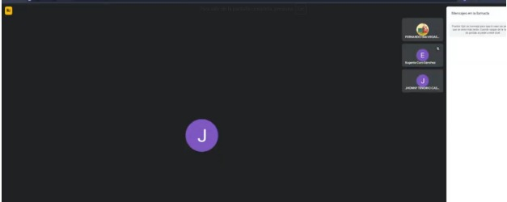

Crear historias de usuario es fundamental en la metodología Scrum porque permiten definir de manera clara las necesidades del cliente o usuario final, asegurando un desarrollo enfocado en el valor y en los objetivos principales del proyecto.

## ENTRADAS

### Equipo Principal de Scrum

- **Scrum Master:** Luque Cárdenas, Marjorie
- **Product Owner:** Tenorio Casiano, Jhonny
- **Equipo de desarrollo:**
  <ul style={{ listStyleType: 'circle', paddingLeft: '20px' }}>
    <li>Vegas Villar, Fernando</li>
    <li>Asunción Pomasonco, Alexia Nicol</li>
    <li>Navarro Tantalean, Daniel</li>
  </ul>

### Backlog priorizado del producto

| ID  | Épicas priorizadas                 | Prioridad (MoSCoW) |
| --- | ---------------------------------- | ------------------ |
| 1   | Página de bienvenida               | Must Have          |
| 2   | Gestión de citas de clientes       | Must Have          |
| 3   | Gestión de contenido del sitio web | Should Have        |

### Criterios de terminado

- **Funcionalidad Completada:** La historia de usuario debe cumplir con todos los requerimientos funcionales establecidos en los criterios de aceptación. El software debe funcionar correctamente y sin errores.
- **Pruebas Completadas:** Todas las pruebas automatizadas (unitarias, de integración y de aceptación) deben ejecutarse correctamente para asegurar la calidad.
- **Revisión de Código realizada:** El código fuente debe ser revisado por un miembro del equipo para garantizar calidad, optimización y ausencia de errores.
- **Documentación Técnica Actualizada:** Toda la documentación relacionada con los cambios debe estar clara y lista para futuros desarrollos o mantenimiento.

## HERRAMIENTAS

- **Reunión entre el stakeholder y el cliente.**

## SALIDAS

### Historias de usuario

- **Historia 1:** Como usuario que gestiona reservas quiero poder filtrar las reservas por estado y cambiar su estado a "finalizada" para gestionar de manera eficiente las reservas pendientes y finalizadas.
- **Historia 2:** Como usuario que gestiona reservas quiero poder filtrar las reservas por fecha y tener paginación en las secciones de reservas para encontrar rápidamente las reservas y navegar eficientemente.
- **Historia 3:** Como dueña quiero poder gestionar los servicios y adicionales y mostrar el precio pendiente por pagar en las reservas para controlar los servicios disponibles y los pagos pendientes.
- **Historia 4:** Como dueña quiero poder editar el contenido de la landing page para actualizar fácilmente la información visible para los usuarios sin necesidad de intervención técnica.
- **Historia 5:** Como administrador quiero poder observar la lista de reclamos de nuestros clientes para tener un mejor control de los posibles reclamos.

### Historias de usuario y criterios de aceptación

| **Historia**    | **Criterios de Aceptación** |
|------------------|-----------------------------|
| **Historia 1:** | 1. El sistema debe permitir filtrar las reservas por estado (pendiente/terminada).  2. El botón de "Finalizar" debe cambiar el estado de una reserva a "finalizada" y reflejarse correctamente en la base de datos. |
| **Historia 2:** | 1. El sistema debe permitir filtrar las reservas por fecha (día o rango).  2. Las secciones con muchas reservas deben implementar paginación para navegar eficientemente. |
| **Historia 3:** | 1. El precio pendiente debe mostrarse junto a cada reserva y actualizarse dinámicamente con los pagos realizados.  2. El administrador debe poder añadir, editar y eliminar servicios y adicionales desde la interfaz de gestión. |
| **Historia 4:** | 1. El sistema debe permitir editar el contenido de la landing page, incluyendo texto, imágenes y enlaces.  2. Los cambios realizados deben reflejarse de inmediato en el sitio público sin despliegue adicional. |
| **Historia 5:** | 1. La vista de los reclamos debe estar visible en todo momento y reflejarse inmediatamente.  2. Se debe poder enviar correos de confirmación al cliente y al administrador. |
