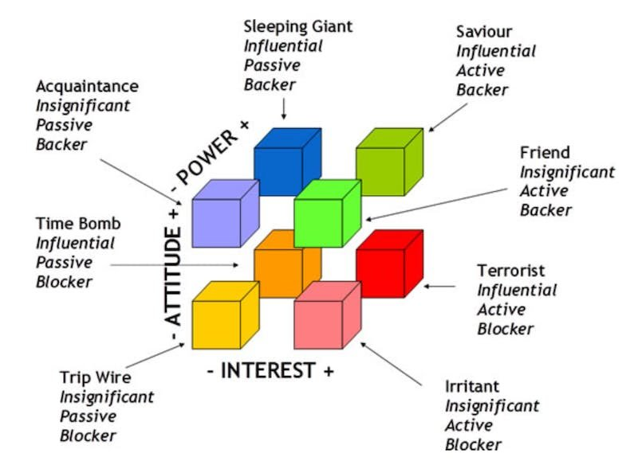

# Análisis de Interesados: Cubo de Interesados

## Introducción

El análisis de interesados es una etapa crucial en la planificación de cualquier proyecto, ya que nos permite entender las expectativas, preocupaciones e influencia de cada persona o grupo involucrado. Una herramienta útil para clasificar a los interesados es el "Cubo de Interesados", el cual evalúa tres dimensiones clave: **poder**, **interés** y **actitud**. A continuación, detallo cómo he utilizado esta herramienta para identificar y clasificar a los principales interesados en el proyecto de mejora de marketing digital para una empresa de muebles.

### Proceso de Elaboración

Para la elaboración del cubo de interesados, se siguieron los siguientes pasos:

1. **Identificación de interesados**: El primer paso fue identificar a todas las personas y grupos que podrían verse afectados por el proyecto, tanto dentro como fuera de la empresa. En este caso, los interesados incluyen al personal directivo, clientes actuales y potenciales, proveedores, y miembros clave del equipo de TI.

2. **Evaluación del poder, interés y actitud**: Luego, se evaluó el nivel de poder, interés y actitud de cada interesado en relación con el proyecto. Se utilizó una escala sencilla, con valores de "+" (positivo/alto) y "-" (negativo/bajo) para reflejar su influencia y posicionamiento. Esta clasificación se reflejó en la tabla que he presentado en la imagen del cubo.

3. **Clasificación y categorización**: Basándome en los valores de poder, interés y actitud, se clasificó a los interesados en categorías. Estas categorías permiten definir cómo abordar a cada interesado en el desarrollo del proyecto. Las categorías principales que se utilizaron fueron:

   - **Influyente Activo Bloqueador**: Alta influencia y actitud negativa hacia el proyecto. Es esencial gestionar sus preocupaciones y convertirlas, si es posible, en una actitud positiva.
   - **Influyente Pasivo Partidario**: Aunque tienen alto poder, su interés es bajo, por lo que es importante mantenerlos informados sin sobrecargarlos con detalles.
   - **Insignificante Activo Partidario**: Estos interesados apoyan el proyecto, pero tienen poco poder o influencia, por lo que su participación puede ser pasiva.

<iframe
	style='width: 100%; height: 500px;'
	src='https://docs.google.com/spreadsheets/d/e/2PACX-1vSj4xtXmN4Ts1Zbl7ubjRA4LCrMrYHjAmIrvi3mlJLmNLIup7ff9nmI-fZNxBuYXqjMWg9CFkNmhHoL/pubhtml?gid=1170421490&amp;single=true&amp;widget=true&amp;headers=false'
></iframe>

## Resultados y Plan de Acción

El cubo de interesados me permitió identificar diferentes enfoques para gestionar a cada grupo de interesados de manera eficaz. Por ejemplo:

- **Hermógenes Yucra** fue clasificado como "Influyente Pasivo Partidario", lo que significa que tiene una influencia alta, pero su interés en los detalles del proyecto es bajo. En este caso, es importante proporcionarle actualizaciones regulares sin saturarlo de información técnica.
- **Manuel**, en cambio, fue clasificado como "Insignificante Pasivo Bloqueador", lo que indica que, aunque su influencia es limitada, su actitud hacia el proyecto es negativa. Aquí, la estrategia consistirá en minimizar su resistencia y asegurarnos de que no afecte a los demás interesados.

## Conclusión

El uso del Cubo de Interesados me permitió comprender mejor el entorno de las partes interesadas y desarrollar una estrategia efectiva para gestionar sus expectativas. Clasificar a los interesados según su poder, interés y actitud facilita la asignación de esfuerzos y recursos para garantizar que las relaciones con ellos se gestionen adecuadamente, lo que contribuirá al éxito del proyecto.
