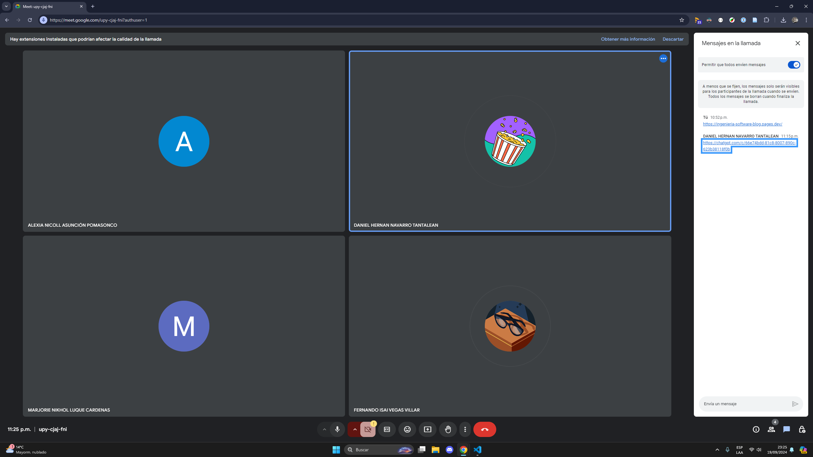

Desarrollar épicas en la metodología Scrum es crucial para Muebles Jhonny E.I.R.L., ya que
permite tener una visión global del proyecto y descomponer las grandes funcionalidades en
historias de usuario más manejables. Esto facilita la priorización de las características que
aportarán mayor valor al negocio, asegurando que el equipo trabaje en lo más relevante primero.
Además, las épicas fomentan la colaboración entre el propietario, los vendedores y el grupo de Scrum,
alineando sus expectativas y objetivos.

# ENTRADAS

## Equipo principal de Scrum

- Product Owner: Alexia Nicoll Asunción Pomazonco.
- Scrum Master: Marjorie Luque Cárdenas.

Developers:

- Fernando Isai Vegas Villar: Especialista en el desarrollo backend y gestión de bases de datos.
- Jhony Tenorio Casiano: Responsable del desarrollo frontend y diseño de interfaces de usuario.
- Daniel Navarro Tantalean: Encargado de la integración del sistema y control de calidad.

## Declaración de la visión del proyecto

Desarrollar un sistema de gestión de inventario que permita a "Muebles Jhonny E.I.R.L." gestionar
eficientemente los materiales, productos en proceso y productos terminados, facilitando el control
de stock y la planificación de la producción.

# HERRAMIENTAS

## Reuniones del equipo Scrum

Las reuniones del equipo Scrum son una herramienta fundamental en el proceso de descripción de épicas.
Estas permiten que el equipo Scrum discuta y comparta perspectivas sobre las funcionalidades que
necesita la empresa. A través del diálogo con el propietario del producto, se identifican las necesidades
clave y expectativas del negocio, lo que facilita la definición de las épicas. Este enfoque asegura que
el equipo tenga una mejor comprensión de los requerimientos del proyecto, mejorando la alineación con
los objetivos de la empresa y fomentando un sentido de propiedad y compromiso entre todos los participantes.

# SALIDAS

## Épicas

Las épicas son esenciales porque proporcionan una visión general de las funcionalidades
del producto, ayudan a priorizar tareas y permiten descomponer el trabajo en historias de usuario
más manejables. Fomentan la colaboración entre el equipo y los stakeholders, ofrecen flexibilidad
ante cambios en los requisitos y facilitan el seguimiento del progreso, asegurando que el trabajo
esté alineado con los objetivos estratégicos de la organización y maximizando el impacto de las
entregas.

| Épica                                  | Historia de Usuario                                                                            |
| -------------------------------------- | ---------------------------------------------------------------------------------------------- |
| Gestión de Materias Primas             | - Como usuario, quiero registrar materias primas para poder llevar un control de stock.        |
| Alertas de Stock Mínimo                | - Como usuario, quiero recibir alertas de stock mínimo para evitar escasez.                    |
| Asignación de Materias Primas          | - Como usuario, quiero asignar materias primas a productos en proceso.                         |
| Historial de Movimientos de Inventario | - Como usuario, quiero ver el historial de movimientos de las materias primas.                 |
| Monitoreo de Productos en Proceso      | - Como usuario, quiero monitorear el estado de los productos en proceso para planificar mejor. |
| Generación de Reportes de Inventario   | - Como usuario, quiero generar reportes de stock de materias primas para análisis.             |
| Configuración de Roles y Permisos      | - Como administrador, quiero configurar roles y permisos para los usuarios.                    |
