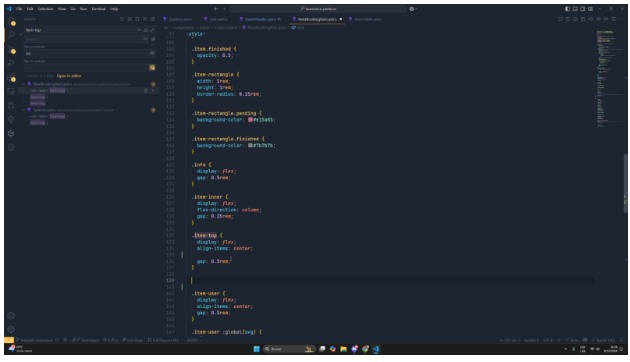
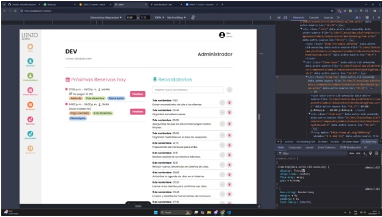

Comprometer historias de usuario en Scrum asegura que el equipo trabaje de manera organizada y alineada con los objetivos del negocio. Este compromiso fomenta la responsabilidad, facilita la planificación realista basada en la capacidad del equipo y asegura la entrega de valor constante enfocándose en las prioridades.

## ENTRADAS

### Equipo Principal de Scrum

- **Scrum Master:** Luque Cárdenas, Marjorie
- **Product Owner:** Tenorio Casiano, Jhonny
- **Equipo de desarrollo:**
  <ul style={{ listStyleType: 'circle', paddingLeft: '20px' }}>
    <li>Vegas Villar, Fernando</li>
    <li>Asunción Pomasonco, Alexia Nicol</li>
    <li>Navarro Tantalean, Daniel</li>
  </ul>

### Historias de Usuario Estimadas

| **Historia de Usuario**                                                                                                        | **Valor Final** |
|-------------------------------------------------------------------------------------------------------------------------------|-----------------|
| **Historia 1:** Como usuario que gestiona reservas quiero poder filtrar las reservas por estado y cambiar su estado a "finalizada" para gestionar de manera eficiente las reservas pendientes y finalizadas. | 5               |
| **Historia 2:** Como usuario que gestiona reservas quiero poder filtrar las reservas por fecha y tener paginación en las secciones de reservas, para encontrar rápidamente las reservas por fecha y navegar eficientemente entre ellas. | 5               |
| **Historia 3:** Como dueña quiero poder gestionar los servicios y adicionales y mostrar el precio pendiente por pagar en las reservas para controlar los servicios disponibles y los pagos pendientes. | 8               |
| **Historia 4:** Como dueña quiero poder editar el contenido de la landing page para actualizar fácilmente la información visible para los usuarios sin necesidad de intervención técnica. | 13              |
| **Historia 5:** Como administrador quiero poder observar la lista de reclamos de nuestros clientes para tener un mejor control de los reclamos posibles. | 5               |

### Duración del Sprint

El sprint tendrá una duración de 2 semanas:
**Noviembre - Diciembre 2024**

## HERRAMIENTAS

### Reunión de Sprint

## SALIDAS

### Historias de Usuario Comprometidas

- **Historia 1:** Como usuario que gestiona reservas quiero poder filtrar las reservas por estado y cambiar su estado a "finalizada" para gestionar de manera eficiente las reservas pendientes y finalizadas.
- **Historia 2:** Como usuario que gestiona reservas quiero poder filtrar las reservas por fecha y tener paginación en las secciones de reservas, para encontrar rápidamente las reservas por fecha y navegar eficientemente entre ellas.
- **Historia 3:** Como dueña quiero poder gestionar los servicios y adicionales y mostrar el precio pendiente por pagar en las reservas para controlar los servicios disponibles y los pagos pendientes.
- **Historia 4:** Como dueña quiero poder editar el contenido de la landing page para actualizar fácilmente la información visible para los usuarios sin necesidad de intervención técnica.
- **Historia 5:** Como administrador quiero poder observar la lista de reclamos de nuestros clientes para tener un mejor control de los reclamos posibles.
