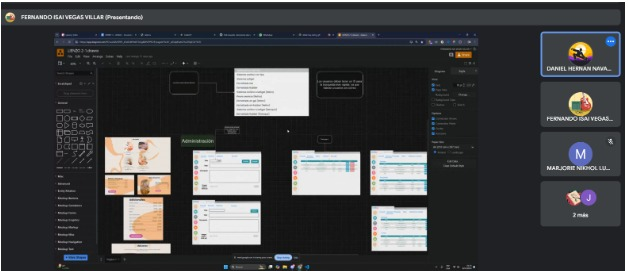
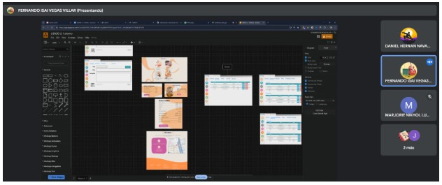

Una vez que el equipo se compromete a completar ciertas historias durante un sprint, es necesario dividirlas en tareas más pequeñas para facilitar la planificación, la asignación de responsabilidades y el seguimiento del progreso. Esta identificación permite al equipo trabajar de manera organizada y eficiente, asegurando que todos los miembros sepan exactamente qué deben hacer para alcanzar los objetivos del sprint y entregar valor al cliente dentro del tiempo establecido.

## ENTRADAS

### Equipo Principal de Scrum

- **Scrum Master:** Luque Cárdenas, Marjorie
- **Product Owner:** Tenorio Casiano, Jhonny
- **Equipo de desarrollo:**
  <ul style={{ listStyleType: 'circle', paddingLeft: '20px' }}>
  	<li>Vegas Villar, Fernando</li>
  	<li>Asunción Pomasonco, Alexia Nicoll</li>
  	<li>Navarro Tantalean, Daniel</li>
  </ul>

### Historias de usuario comprometidas

- Historia 1: Como usuario que gestiona reservas quiero poder filtrar las reservas por estado y cambiar su estado a "finalizada" para que pueda gestionar de manera eficiente las reservas pendientes y finalizadas.
- Historia 2: Como usuario que gestiona reservas quiero poder filtrar las reservas por fecha y tener paginación en las secciones de reservas, para que pueda encontrar rápidamente las reservas por fecha y navegar eficientemente entre ellas.
- Historia 3: Como dueña quiero poder gestionar los servicios y adicionales, y mostrar el precio pendiente por pagar en las reservas para que pueda controlar los servicios disponibles y hacer un seguimiento de los pagos pendientes.
- Historia 4: Como dueña del negocio, quiero que el menú de precios en la landing page muestre automáticamente los servicios y extras desde la base de datos, adaptándose a los cambios, para garantizar información siempre actualizada.
- Historia 5: Como administrador quiero poder observar la lista de reclamos de nuestros clientes para poder tener un mejor control de los reclamos posibles.

## HERRAMIENTAS

### Reunión del Sprint

En esta reunión, el equipo Scrum, junto con el Product Owner, define qué historias de usuario o elementos del backlog se priorizarán y se comprometen a completarlas dentro del sprint. El equipo también desglosa estas historias en tareas más pequeñas, asigna responsabilidades y estima el esfuerzo necesario.

## SALIDAS

### Lista de tareas

#### Historia 1: Como usuario que gestiona reservas quiero poder filtrar las reservas por estado y cambiar su estado a "finalizada" para que pueda gestionar de manera eficiente las reservas pendientes y finalizadas.

#### Tareas:

- **Tarea 1.1:** Añadir filtro por pendiente o terminada en sección de reservas.
- **Tarea 1.2:** Añadir botón de "Finalizar" en la sección de Reservas (para cambiar el estado de la reserva de "pendiente" a "finalizada").

#### Historia 2: Como usuario que gestiona reservas quiero poder filtrar las reservas por fecha y tener paginación en las secciones de reservas, para que pueda encontrar rápidamente las reservas por fecha y navegar eficientemente entre ellas.

#### Tareas:

- **Tarea 2.1:** Añadir filtro por día en la sección de reservas.
- **Tarea 2.2:** Añadir paginación en cada sección que la necesite (como la sección de reservas).

#### Historia 3: Como dueña quiero poder gestionar los servicios y adicionales, y mostrar el precio pendiente por pagar en las reservas para que pueda controlar los servicios disponibles y hacer un seguimiento de los pagos pendientes.

#### Tareas:

- **Tarea 3.1:** Agregar CRUD para los servicios y adicionales (Añadir, eliminar y editar servicios y adicionales).
- **Tarea 3.2:** Agregar el precio que falta por pagar por cada reserva en la sección de Próximas Reservas.

#### Historia 4: Como dueña del negocio, quiero que el menú de precios en la landing page muestre automáticamente los servicios y extras desde la base de datos, adaptándose a los cambios, para garantizar información siempre actualizada.

#### Tareas:

- **Tarea 4.1:** Modificar el layout del menú de precios para que se adapte automáticamente a una cantidad dinámica de servicios y extras.
- **Tarea 4.2:** Mostrar los servicios y extras leyéndolos desde la base de datos en el Landing Page.

#### Historia 5: Como administrador quiero poder observar la lista de reclamos de nuestros clientes para poder tener un mejor control de los reclamos posibles.

#### Tareas:

- **Tarea 5.1:** Agregar sección donde se pueda visualizar los reclamos.
- **Tarea 5.2:** Notificar sobre el nuevo reclamo vía email al usuario y al administrador.
