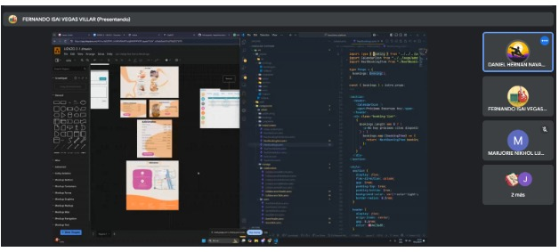
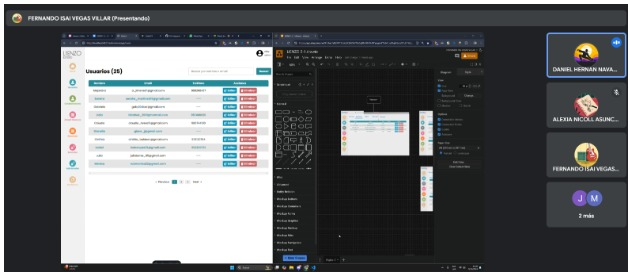
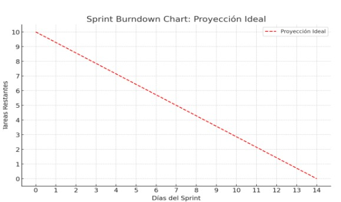

## **Entradas:**

**Equipo Principal de Scrum**

- **Scrum Master:** Luque Cárdenas, Marjorie
- **Product Owner:** Tenorio Casiano, Jhonny
- **Equipo de Desarrollo:**
  - Vegas Villar, Fernando
  - Asunción Pomansonco, Alexia Nicol
  - Navarro Tantalean, Daniel

---

## **Effort Estimated Task List:**

| **Historia**  | **Tarea**                                                                                                                   | **Esfuerzo (Horas)** |
|---------------|-----------------------------------------------------------------------------------------------------------------------------|----------------------|
| Historia 1    | **Tarea 1.1**: Añadir Filtro por pendiente o terminada en sección de reservas.                                                | 3                    |
| Historia 1    | **Tarea 1.2**: Añadir botón de "Finalizar" en la sección de Reservas (para cambiar el estado de la reserva de "pendiente" a "finalizada"). | 5                    |
| Historia 2    | **Tarea 2.1**: Añadir Filtro por día en la sección de reservas.                                                              | 5                    |
| Historia 2    | **Tarea 2.2**: Añadir Paginación en cada sección que la necesite (como la sección de reservas).                              | 3                    |
| Historia 3    | **Tarea 3.1**: Agregar CRUD para los servicios y adicionales (Añadir, eliminar y editar servicios y adicionales).              | 8                    |
| Historia 3    | **Tarea 3.2**: Agregar el precio que falta por pagar por cada reserva en la sección de Próximas Reservas.                    | 5                    |
| Historia 4    | **Tarea 4.1**: Agregar sección de "Landing" donde se pueda editar cosas puntuales del contenido del landing page.            | 8                    |
| Historia 4    | **Tarea 4.2**: Agregar módulo para editar texto, imágenes y enlaces en la landing page.                                       | 13                   |
| Historia 5    | **Tarea 5.1**: Agregar sección donde se pueda visualizar los reclamos.                                                      | 5                    |
| Historia 5    | **Tarea 5.2**: Notificar sobre el nuevo reclamo vía email al usuario y al administrador.                                     | 5                    |

**Duración del Sprint:** 2 semanas

## **Herramientas:**

**Reunión de Planificación del Sprint**

## **Salidas:**

| **Historia**  | **Tarea**                                                                                                                   | **Esfuerzo (Horas)** | **Responsable** | **Prioridad** |
|---------------|-----------------------------------------------------------------------------------------------------------------------------|----------------------|-----------------|---------------|
| Historia 1    | **Tarea 1.1**: Añadir Filtro por pendiente o terminada en sección de reservas.                                                | 3                    | Fernando        | Medio - Alta  |
| Historia 1    | **Tarea 1.2**: Añadir botón de "Finalizar" en la sección de Reservas (para cambiar el estado de la reserva de "pendiente" a "finalizada"). | 5                    | Alexia          | Medio - Alta  |
| Historia 2    | **Tarea 2.1**: Añadir Filtro por día en la sección de reservas.                                                              | 5                    | Daniel          | Alta          |
| Historia 2    | **Tarea 2.2**: Añadir Paginación en cada sección que la necesite (como la sección de reservas).                              | 3                    | Daniel          | Alta          |
| Historia 3    | **Tarea 3.1**: Agregar CRUD para los servicios y adicionales (Añadir, eliminar y editar servicios y adicionales).              | 8                    | Fernando        | Alta          |
| Historia 3    | **Tarea 3.2**: Agregar el precio que falta por pagar por cada reserva en la sección de Próximas Reservas.                    | 5                    | Daniel          | Alta          |
| Historia 4    | **Tarea 4.1**: Agregar sección de "Landing" donde se pueda editar cosas puntuales del contenido del landing page.            | 8                    | Alexia          | Alta          |
| Historia 4    | **Tarea 4.2**: Agregar módulo para editar texto, imágenes y enlaces en la landing page.                                       | 13                   | Fernando        | Alta          |
| Historia 5    | **Tarea 5.1**: Agregar sección donde se pueda visualizar los reclamos.                                                      | 5                    | Alexia          | Media         |
| Historia 5    | **Tarea 5.2**: Notificar sobre el nuevo reclamo vía email al usuario y al administrador.                                     | 5                    | Fernando        | Media         |

**Sprint Burndown Chart:**
