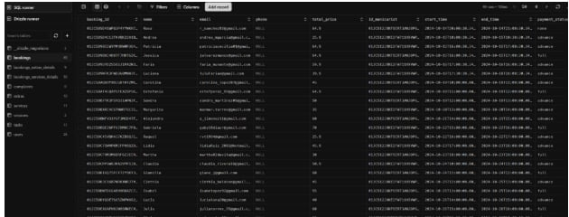
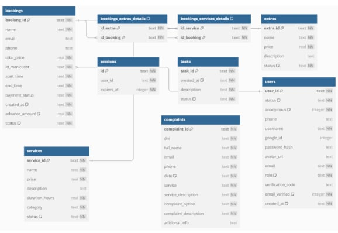
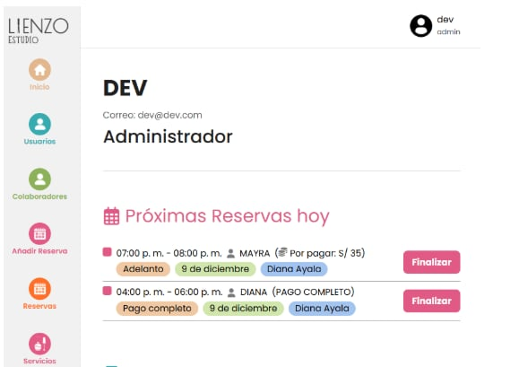
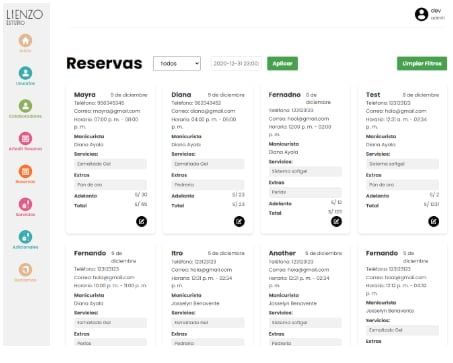
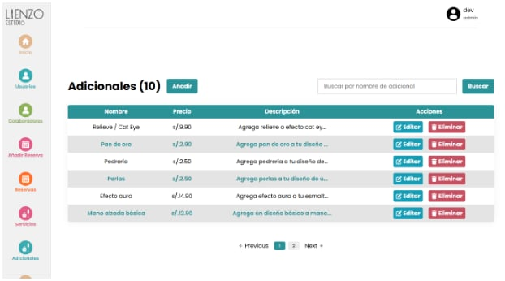
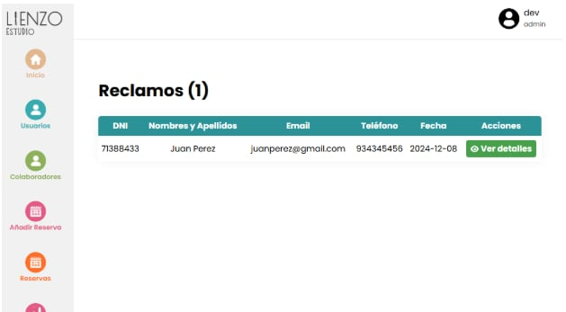
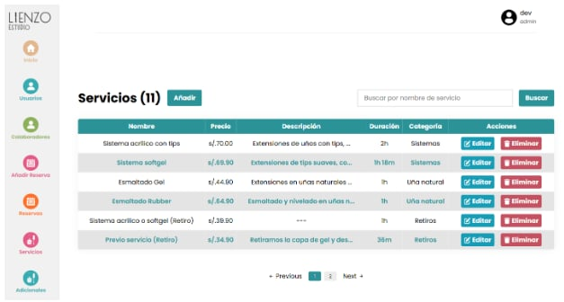

## EQUIPO XP

### Rol en XP

- **Coach**: Marjorie  
  _Facilitar la adopción de XP, guiar al equipo en las mejores prácticas de desarrollo y garantizar la mejora continua._
- **Cliente**: Jhonny  
  _Definir y priorizar las historias de usuario, dar retroalimentación constante y validar entregas._
- **Programadores**: Fernando, Alexia, Daniel  
  _Escribir código, hacer refactorización, trabajar en pareja y asegurar la calidad del código._
- **Encargado de prueba**: Daniel  
  _Escribir pruebas unitarias, de integración y de aceptación antes de escribir el código._
- **Encargado de Seguimiento (Tracker)**: Marjorie  
  _Monitorización del progreso del equipo y el aseguramiento de que el proyecto se mantenga en el camino correcto para cumplir con los objetivos._
- **Consultor**: Arqque Pantigozo Antonio  
  _Es un miembro externo del equipo con un conocimiento específico en algún tema necesario para el proyecto. Ayuda al equipo a resolver un problema específico._

## PLANIFICACIÓN DEL LANZAMIENTO

### Duración de la iteración

**2 Semanas**

### HISTORIAS DE USUARIO XP

**Historia de Usuario 1**  

---

**Historia de Usuario 2**  

---

**Historia de Usuario 3**  

---

**Historia de Usuario 4**  

---

**Historia de Usuario 5**  

---

## DISEÑO SIMPLE

### MODELO DE LA BASE DE DATOS

### MODELO LÓGICO

## TARJETAS CRC

---

## PROTOTIPOS

_Insertar prototipos aquí_

