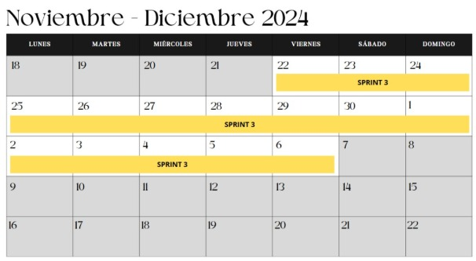

---
title: "Diseño de Proyecto"
description: "En este post se explica el diseño y la planificación de un proyecto de gestión de citas."
heroImage: "/images/hero-image.jpg"
category: "Sprint 3"
tags: 
  - "proyecto"
  - "gestión"
  - "citas"
pubDate: "2024-12-12T00:00:00Z"
---
## EQUIPO XP

### Rol en XP

- **Coach**: Marjorie  
  *Facilitar la adopción de XP, guiar al equipo en las mejores prácticas de desarrollo y garantizar la mejora continua.*
  
- **Cliente**: Jhonny  
  *Definir y priorizar las historias de usuario, dar retroalimentación constante y validar entregas.*
  
- **Programadores**: Fernando, Alexia, Daniel  
  *Escribir código, hacer refactorización, trabajar en pareja y asegurar la calidad del código.*
  
- **Encargado de prueba**: Daniel  
  *Escribir pruebas unitarias, de integración y de aceptación antes de escribir el código.*
  
- **Encargado de Seguimiento (Tracker)**: Marjorie  
  *Monitorización del progreso del equipo y el aseguramiento de que el proyecto se mantenga en el camino correcto para cumplir con los objetivos.*
  
- **Consultor**: Arqque Pantigozo Antonio  
  *Es un miembro externo del equipo con un conocimiento específico en algún tema necesario para el proyecto. Ayuda al equipo a resolver un problema específico.*

## PLANIFICACIÓN DEL LANZAMIENTO

### Duración de la iteración
**2 Semanas**

### Plan de Iteración: Sprint 3

#### PARA HISTORIA DE USUARIO

**Historia de Usuario 1**  
- **Número**: HU01  
- **Usuario**: Lienzo Lima  
- **Nombre de Historia**: Como usuario que gestiona reservas, quiero poder filtrar las reservas por estado y cambiar su estado a "finalizada", para que pueda gestionar de manera eficiente las reservas pendientes y finalizadas.  
- **Prioridad en Negocio**: Medio - Alto  
- **Riesgo en Desarrollo**: Si no se implementa correctamente, podría causar inconsistencias en el sistema (como reservas que no se actualizan o un filtro que no muestra resultados correctamente).  
- **Puntos Estimados**: 5  
- **Iteración Asignada**: Primera iteración  
- **Programador Responsable**: Fernando - Alexia  
- **Descripción**: Esta historia de usuario permite a los usuarios filtrar las reservas por estado y cambiar el estado de las reservas a "finalizada" a través de un botón.  
- **Observaciones**: Depende de la configuración adecuada de la base de datos.

---

**Historia de Usuario 2**  
- **Número**: HU02  
- **Usuario**: Lienzo Lima  
- **Nombre de Historia**: Como usuario que gestiona reservas, quiero poder filtrar las reservas por fecha y tener paginación en las secciones de reservas.  
- **Prioridad en Negocio**: Alta  
- **Riesgo en Desarrollo**: Cambios en la interfaz de usuario y lógica del backend pueden generar errores si no se implementan correctamente.  
- **Puntos Estimados**: 5  
- **Iteración Asignada**: Primera iteración  
- **Programador Responsable**: Daniel  
- **Descripción**: Esta historia permite filtrar reservas por fecha y navegar eficientemente con paginación.  
- **Observaciones**: Requiere estructura adecuada para manejar fechas de reservas.

---

**Historia de Usuario 3**  
- **Número**: HU03  
- **Usuario**: Lienzo Lima  
- **Nombre de Historia**: Como dueña, quiero poder gestionar los servicios y adicionales, y mostrar el precio pendiente por pagar en las reservas.  
- **Prioridad en Negocio**: Alta  
- **Riesgo en Desarrollo**: Errores en la gestión del CRUD para servicios y el cálculo del precio pendiente pueden afectar la integridad de los datos.  
- **Puntos Estimados**: 8  
- **Iteración Asignada**: Sprint 3  
- **Programador Responsable**: Fernando - Daniel  
- **Descripción**: Permite a la dueña gestionar servicios y adicionales, y actualizar el precio pendiente por pagar en cada reserva.  
- **Observaciones**: Requiere una base de datos adecuada.

---

**Historia de Usuario 4**  
- **Número**: HU04  
- **Usuario**: Lienzo Lima  
- **Nombre de Historia**: Como dueña quiero poder editar el contenido de la landing page para actualizar fácilmente la información visible para los usuarios.  
- **Prioridad en Negocio**: Alta  
- **Riesgo en Desarrollo**: Errores en la interfaz de edición pueden resultar en información desactualizada.  
- **Puntos Estimados**: 13  
- **Iteración Asignada**: Sprint 3  
- **Programador Responsable**: Fernando - Alexia  
- **Descripción**: Permite editar el contenido de la landing page de manera fácil y sin intervención técnica.  
- **Observaciones**: La página debe ser flexible para cambios en tiempo real.

---

**Historia de Usuario 5**  
- **Número**: HU05  
- **Usuario**: Lienzo Lima  
- **Nombre de Historia**: Como administrador quiero observar la lista de reclamos de los clientes para tener un mejor control de los reclamos.  
- **Prioridad en Negocio**: Medio  
- **Riesgo en Desarrollo**: Riesgo de notificaciones incorrectas sobre reclamos.  
- **Puntos Estimados**: 5  
- **Iteración Asignada**: Sprint 3  
- **Programador Responsable**: Fernando - Alexia  
- **Descripción**: Permite al administrador observar la lista de reclamos y recibir notificaciones.  
- **Observaciones**: Requiere una estructura flexible para los reclamos.

---

## DISEÑO SIMPLE

### MODELO DE LA BASE DE DATOS

### MODELO LÓGICO

## TARJETA CRC

### Nombre del proyecto: Gestión de Citas para Lienzo Lima  
**Fecha sesión**: 22/11/2024  

- **Clase**: NextBookings  
  *Responsabilidades*: Gestión de tipos y funciones relacionadas con los bookings.  
  *Colaboradores*: Booking, CalendarIcon, NextBookingItem

- **Clase**: ExtrasTable.astro  
  *Responsabilidades*: Mostrar la cabecera de la tabla y gestionar formularios.  
  *Colaboradores*: TableHead, TableRow, ExtrasEditButton, ExtrasDeleteButton

- **Clase**: BookingsList.astro  
  *Responsabilidades*: Gestionar tarjetas de cada booking.  
  *Colaboradores*: BookingCard, Booking

---

## PROTOTIPOS

*Insertar prototipos aquí*

