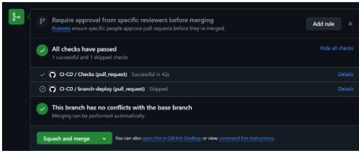
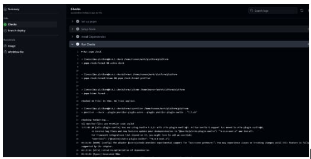
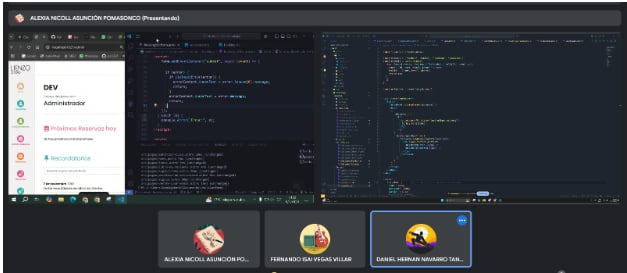
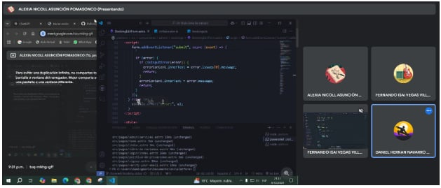

# **Equipo XP:**

## **Roles y Responsabilidades**

- **Coach:** Marjorie  
    Facilita la adopción de XP, guía al equipo en las mejores prácticas de desarrollo y asegura la mejora continua.
  
- **Cliente:** Jhonny  
    Define y prioriza las historias de usuario, da retroalimentación constante y valida entregas.
  
- **Programadores:** Fernando, Alexia, Daniel  
    Escriben código, hacen refactorización, trabajan en pareja y aseguran la calidad del código.
  
- **Encargado de Prueba:** Daniel  
    Escribe pruebas unitarias, de integración y de aceptación antes de escribir el código.

- **Encargado de Seguimiento (Tracker):** Marjorie  
    Monitorea el progreso del equipo y asegura que el proyecto se mantenga en el camino correcto para cumplir con los objetivos.

- **Consultor:** Arqque Pantigozo Antonio  
    Miembro externo con conocimiento especializado para ayudar en problemas técnicos específicos del proyecto.

---

## **Historias de Usuario y Tareas**

### **Historia de Usuario 1: HU01**

#### Usuario: Lienzo Lima  
**Nombre:** Como usuario que gestiona reservas, quiero poder filtrar las reservas por estado y cambiar su estado a "finalizada", para poder gestionar las reservas pendientes y finalizadas de manera eficiente.

- **Prioridad en Negocio:** Medio - Alto  
- **Riesgo en Desarrollo:** Inconsistencias en el sistema si no se implementa correctamente.
- **Puntos Estimados:** 5  
- **Iteración Asignada:** Primera Iteración  
- **Programadores Responsables:** Fernando - Alexia  

**Descripción:** Permite filtrar las reservas por estado y cambiar su estado a "finalizada" de manera eficiente.  
**Observaciones:** Dependencia de la configuración adecuada de la base de datos.

---

#### **Tareas:**

##### **Tarea TH01-1**  
- **Nombre:** Añadir Filtro por pendiente o terminada en sección de reservas  
- **Tipo de tarea:** Desarrollo  
- **Puntos estimados:** 3  
- **Fecha de inicio:** 22/11/2024  
- **Fecha fin:** 06/12/2024  
- **Programador responsable:** Fernando  

##### **Tarea TH01-2**  
- **Nombre:** Añadir botón de "Finalizar" en la sección de Reservas  
- **Tipo de tarea:** Desarrollo  
- **Puntos estimados:** 5  
- **Fecha de inicio:** 22/11/2024  
- **Fecha fin:** 06/12/2024  
- **Programador responsable:** Alexia  

---

### **Historia de Usuario 2: HU02**

#### Usuario: Lienzo Lima  
**Nombre:** Como usuario que gestiona reservas quiero poder filtrar las reservas por fecha y tener paginación en las secciones de reservas, para que pueda encontrar rápidamente las reservas por fecha y navegar eficientemente entre ellas.

- **Prioridad en Negocio:** Alta  
- **Riesgo en Desarrollo:** Errores en visualización de reservas o afectación en rendimiento.
- **Puntos Estimados:** 5  
- **Iteración Asignada:** Primera Iteración  
- **Programador Responsable:** Daniel

**Descripción:** Permite filtrar reservas por fecha y navegar entre ellas utilizando paginación.  
**Observaciones:** Dependencia de la correcta organización de las fechas en la base de datos.

---

#### **Tareas:**

##### **Tarea TH02-1**  
- **Nombre:** Añadir Filtro por día en la sección de reservas  
- **Tipo de tarea:** Desarrollo  
- **Puntos estimados:** 5  
- **Fecha de inicio:** 22/11/2024  
- **Fecha fin:** 06/12/2024  
- **Programador responsable:** Daniel  

##### **Tarea TH02-2**  
- **Nombre:** Añadir Paginación en cada sección que la necesite  
- **Tipo de tarea:** Desarrollo  
- **Puntos estimados:** 3  
- **Fecha de inicio:** 22/11/2024  
- **Fecha fin:** 06/12/2024  
- **Programador responsable:** Daniel  

---

### **Historia de Usuario 3: HU03**

#### Usuario: Lienzo Lima  
**Nombre:** Como dueña, quiero poder gestionar los servicios y adicionales, y mostrar el precio pendiente por pagar en las reservas, para que pueda controlar los servicios disponibles y hacer un seguimiento de los pagos pendientes.

- **Prioridad en Negocio:** Alta  
- **Riesgo en Desarrollo:** Error en el cálculo del precio pendiente o en la gestión de servicios.
- **Puntos Estimados:** 8  
- **Iteración Asignada:** Sprint 3  
- **Programador Responsable:** Fernando - Daniel  

**Descripción:** Permite gestionar servicios y adicionales y actualizar dinámicamente el precio pendiente por pagar en las reservas.  
**Observaciones:** Requiere estructura adecuada de base de datos.

---

#### **Tareas:**

##### **Tarea TH03-1**  
- **Nombre:** Agregar CRUD para los servicios y adicionales  
- **Tipo de tarea:** Desarrollo  
- **Puntos estimados:** 8  
- **Fecha de inicio:** 22/11/2024  
- **Fecha fin:** 06/12/2024  
- **Programador responsable:** Fernando  

##### **Tarea TH03-2**  
- **Nombre:** Agregar el precio que falta por pagar por cada reserva  
- **Tipo de tarea:** Mejora  
- **Puntos estimados:** 5  
- **Fecha de inicio:** 22/11/2024  
- **Fecha fin:** 06/12/2024  
- **Programador responsable:** Daniel  

---

## **Integración Continua**

La **Integración Continua (CI)** implica la configuración de pipelines automatizados para compilar el código, ejecutar pruebas unitarias y estáticas, y validar que todo funcione correctamente con cada cambio en el repositorio. Este proceso:

- Detecta rápidamente errores y permite resolverlos de manera eficiente.
- Fomenta el desarrollo ágil y confiable al integrar cambios pequeños y frecuentes, reduciendo los conflictos de código.
- Garantiza que el software esté siempre en un estado funcional.

## **Programación en Parejas**

La **programación en parejas** es una práctica clave dentro de XP. Esta técnica implica que dos programadores trabajen juntos en una misma estación de trabajo para escribir código. Existen dos roles principales en esta práctica:

- **Driver:** El programador que escribe el código.
- **Observer (o Navigator):** El programador que revisa, sugiere mejoras y guía al driver en la toma de decisiones.

Esto permite compartir conocimiento, mejorar la calidad del código y resolver problemas de manera más eficiente.

