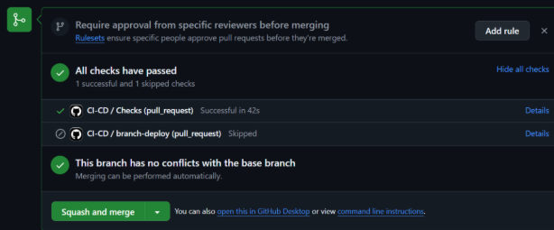

# **Equipo XP**

## **Roles y Responsabilidades**

- **Coach:** Marjorie  
   Facilita la adopción de XP, guía al equipo en las mejores prácticas de desarrollo y asegura la mejora continua.
- **Cliente:** Jhonny  
   Define y prioriza las historias de usuario, da retroalimentación constante y valida entregas.
- **Programadores:** Fernando, Alexia, Daniel  
   Escriben código, hacen refactorización, trabajan en pareja y aseguran la calidad del código.
- **Encargado de Prueba:** Daniel  
   Escribe pruebas unitarias, de integración y de aceptación antes de escribir el código.

- **Encargado de Seguimiento (Tracker):** Marjorie  
   Monitorea el progreso del equipo y asegura que el proyecto se mantenga en el camino correcto para cumplir con los objetivos.

- **Consultor:** Arqque Pantigozo Antonio  
   Miembro externo con conocimiento especializado para ayudar en problemas técnicos específicos del proyecto.

---

## **Historias de Usuario y Tareas**

### **Historia de Usuario 1: HU01**

#### **Tarea TH01-1**

#### **Tarea TH01-2**

---

### **Historia de Usuario 2: HU02**

#### **Tarea TH02-1**

#### **Tarea TH02-2**

---

### **Historia de Usuario 3: HU03**

#### **Tarea TH03-1**

#### **Tarea TH03-2**

---

### **Historia de Usuario 4: HU04**

#### **Tarea TH04-1**

#### **Tarea TH04-2**

---

### **Historia de Usuario 5: HU05**

#### **Tarea TH05-1**

#### **Tarea TH05-2**

---

## **Integración Continua**

La **Integración Continua (CI)** implica la configuración de pipelines automatizados para compilar el código, ejecutar pruebas unitarias y estáticas, y validar que todo funcione correctamente con cada cambio en el repositorio. Este proceso:

- Detecta rápidamente errores y permite resolverlos de manera eficiente.
- Fomenta el desarrollo ágil y confiable al integrar cambios pequeños y frecuentes, reduciendo los conflictos de código.
- Garantiza que el software esté siempre en un estado funcional.

## **Programación en Parejas**

La **programación en parejas** es una práctica clave dentro de XP. Esta técnica implica que dos programadores trabajen juntos en una misma estación de trabajo para escribir código. Existen dos roles principales en esta práctica:

- **Driver:** El programador que escribe el código.
- **Observer (o Navigator):** El programador que revisa, sugiere mejoras y guía al driver en la toma de decisiones.

Esto permite compartir conocimiento, mejorar la calidad del código y resolver problemas de manera más eficiente.

