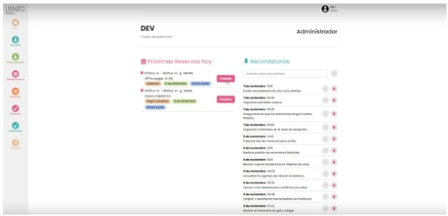
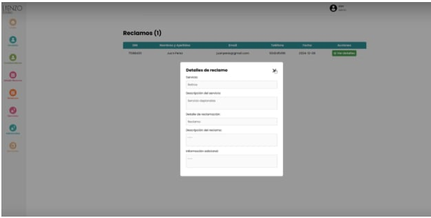
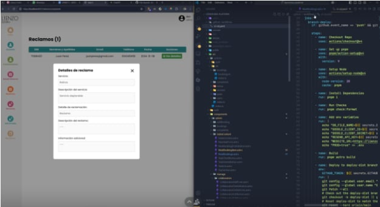
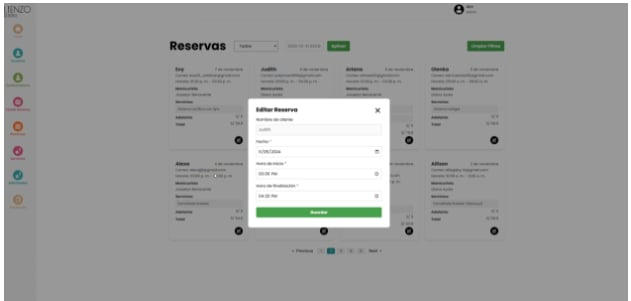

## EQUIPO XP:
### Rol en XP
- **Coach**: Marjorie
  - Facilitar la adopción de XP, guiar al equipo en las mejores prácticas de desarrollo y garantizar la mejora continua.
- **Cliente**: Jhonny
  - Definir y priorizar las historias de usuario, dar retroalimentación constante y validar entregas.
- **Programadores**: Fernando, Alexia, Daniel
  - Escribir código, hacer refactorización, trabajar en pareja y asegurar la calidad del código.
- **Encargado de prueba**: Daniel
  - Escribir pruebas unitarias, de integración y de aceptación antes de escribir el código.
- **Encargado de Seguimiento (Tracker)**: Marjorie
  - Monitorización del progreso del equipo y el aseguramiento de que el proyecto se mantenga en el camino correcto para cumplir con los objetivos.
- **Consultor**: Arqque Pantigozo Antonio
  - Es un miembro externo del equipo con un conocimiento específico en algún tema necesario para el proyecto. Ayuda al equipo a resolver un problema específico.

## HISTORIAS DE USUARIO Y TAREAS:

### Historia de Usuario 1
**Número**: HU01  
**Usuario**: Lienzo Lima  
**Nombre de historia**: Como usuario que gestiona reservas, quiero poder filtrar las reservas por estado y cambiar su estado a "finalizada", para que pueda gestionar de manera eficiente las reservas pendientes y finalizadas.  
**Prioridad en Negocio**: Medio - Alto  
**Riesgo en Desarrollo**: Si no se implementa correctamente, podría causar inconsistencias en el sistema (como reservas que no se actualizan o un filtro que no muestra resultados correctamente), lo que impactaría la experiencia del usuario.  
**Puntos Estimados**: 5  
**Iteración asignada**: Primera iteración  
**Programador responsable**: Fernando - Alexia  
**Descripción**: Esta historia de usuario permite a los usuarios que gestionan reservas poder filtrar las reservas por estado (pendiente/terminada) y cambiar el estado de las reservas a "finalizada" a través de un botón de "Finalizar". El sistema debe permitir filtrar y cambiar el estado de las reservas de manera eficiente, y este cambio debe reflejarse correctamente en la base de datos.  
**Observaciones**: Esta historia de usuario depende de la configuración adecuada de la base de datos, ya que implica un cambio en el estado de las reservas, lo que puede requerir la modificación del esquema de la base de datos.

#### TAREA
- **Número de tarea**: TH01-1  
  **Número de historia**: HU01  
  **Nombre tarea**: Añadir Filtro por pendiente o terminada en sección de reservas.  
  **Tipo de tarea**: Desarrollo  
  **Puntos estimados**: 3  
  **Fecha de inicio**: 22/11/2024  
  **Fecha fin**: 06/12/2024  
  **Programador responsable**: Fernando

#### TAREA
- **Número de tarea**: TH01-2  
  **Número de historia**: HU01  
  **Nombre tarea**: Añadir botón de "Finalizar" en la sección de Reservas (para cambiar el estado de la reserva de "pendiente" a "finalizada").  
  **Tipo de tarea**: Desarrollo  
  **Puntos estimados**: 5  
  **Fecha de inicio**: 22/11/2024  
  **Fecha fin**: 06/12/2024  
  **Programador responsable**: Alexia

---

### Historia de Usuario 2
**Número**: HU02  
**Usuario**: Lienzo Lima  
**Nombre de historia**: Como usuario que gestiona reservas quiero poder filtrar las reservas por fecha y tener paginación en las secciones de reservas, para que pueda encontrar rápidamente las reservas por fecha y navegar eficientemente entre ellas.  
**Prioridad en Negocio**: Alta  
**Riesgo en Desarrollo**: La implementación del filtro por fecha y la paginación involucra cambios tanto en la interfaz de usuario como en la lógica de backend. Aunque el riesgo de impacto técnico es moderado, una implementación incorrecta podría resultar en errores en la visualización de las reservas o afectar el rendimiento del sistema con grandes volúmenes de datos.  
**Puntos Estimados**: 5  
**Iteración asignada**: Primera iteración  
**Programador responsable**: Daniel  
**Descripción**: Esta historia de usuario permite a los usuarios que gestionan las reservas filtrar las reservas por fecha y navegar eficientemente entre las secciones con muchas reservas mediante la implementación de paginación. La funcionalidad debe ser clara y eficiente, y debe proporcionar una forma sencilla de acceder a las reservas pasadas o futuras.  
**Observaciones**: Esta historia depende de que el sistema esté correctamente estructurado para manejar y almacenar las fechas de las reservas. Además, la implementación de la paginación dependerá de la correcta organización y optimización de la base de datos.

#### TAREAS
- **Número de tarea**: TH02-1  
  **Número de historia**: HU02  
  **Nombre tarea**: Añadir Filtro por día en la sección de reservas.  
  **Tipo de tarea**: Desarrollo  
  **Puntos estimados**: 5  
  **Fecha de inicio**: 22/11/2024  
  **Fecha fin**: 06/12/2024  
  **Programador responsable**: Daniel

- **Número de tarea**: TH02-2  
  **Número de historia**: HU02  
  **Nombre tarea**: Añadir Paginación en cada sección que la necesite (como la sección de reservas).  
  **Tipo de tarea**: Desarrollo  
  **Puntos estimados**: 3  
  **Fecha de inicio**: 22/11/2024  
  **Fecha fin**: 06/12/2024  
  **Programador responsable**: Daniel

---

### Historia de Usuario 3
**Número**: HU03  
**Usuario**: Lienzo Lima  
**Nombre de historia**: Como dueña, quiero poder gestionar los servicios y adicionales, y mostrar el precio pendiente por pagar en las reservas, para que pueda controlar los servicios disponibles y hacer un seguimiento de los pagos pendientes.  
**Prioridad en Negocio**: Alta  
**Riesgo en Desarrollo**: La complejidad de esta historia radica en la implementación del CRUD para servicios y adicionales, así como la actualización dinámica del precio pendiente en las reservas. El riesgo principal es que cualquier error en el cálculo del precio pendiente o en la gestión de los servicios podría afectar la integridad de los datos del sistema.  
**Puntos Estimados**: 8  
**Iteración asignada**: Sprint 3  
**Programador responsable**: Fernando - Daniel  
**Descripción**: Permite a la dueña gestionar los servicios y adicionales del sistema y mostrar el precio pendiente por pagar en cada reserva. El administrador podrá añadir, editar o eliminar servicios y adicionales, y el precio pendiente se actualizará dinámicamente a medida que se realicen pagos o se modifiquen las reservas.  
**Observaciones**: Requiere que el sistema tenga una estructura de base de datos que pueda manejar los servicios y adicionales correctamente. Además, se debe garantizar que las modificaciones en los servicios y precios se sincronicen adecuadamente con el resto del sistema.

#### TAREAS
- **Número de tarea**: TH03-1  
  **Número de historia**: HU03  
  **Nombre tarea**: Agregar CRUD para los servicios y adicionales (Añadir, eliminar y editar servicios y adicionales).  
  **Tipo de tarea**: Desarrollo  
  **Puntos estimados**: 8  
  **Fecha de inicio**: 22/11/2024  
  **Fecha fin**: 06/12/2024  
  **Programador responsable**: Fernando

- **Número de tarea**: TH03-2  
  **Número de historia**: HU03  
  **Nombre tarea**: Agregar el precio que falta por pagar por cada reserva en la sección de Próximas Reservas.  
  **Tipo de tarea**: Mejora  
  **Puntos estimados**: 5  
  **Fecha de inicio**: 22/11/2024  
  **Fecha fin**: 06/12/2024  
  **Programador responsable**: Daniel

---

### Historia de Usuario 4
**Número**: HU04  
**Usuario**: Lienzo Lima  
**Nombre de historia**: Cómo dueña quiero poder editar el contenido de la landing page para que pueda actualizar fácilmente la información visible para los usuarios sin necesidad de intervención técnica.  
**Prioridad en Negocio**: Alta  
**Riesgo en Desarrollo**: El riesgo de esta historia radica en la creación de una interfaz de usuario adecuada y fácil de usar para la edición de contenido. Cualquier error en la actualización dinámica de la landing page podría resultar en la desactualización de la información mostrada al público.  
**Puntos Estimados**: 13  
**Iteración asignada**: Sprint 3  
**Programador responsable**: Fernando - Alexia  
**Descripción**: Permite a la dueña editar fácilmente el contenido de la landing page, incluyendo texto, imágenes y enlaces, sin necesidad de intervención técnica. El sistema debe ser lo suficientemente flexible como para permitir modificaciones rápidas y reflejar esos cambios de inmediato en el sitio público.  
**Observaciones**: Se debe implementar un editor de texto fácil de usar, idealmente con una interfaz de tipo WYSIWYG (What You See Is What You Get), y también permitir la subida de imágenes y otros archivos multimedia.

## Tareas

### Tarea TH04-1

**Número de tarea:** TH04-1  
**Número de historia:** HU04  
**Nombre tarea:** Agregar sección de "Landing" donde se pueda editar cosas puntuales del contenido del landing page.  
**Tipo de tarea:** Desarrollo  
**Puntos estimados:** 8  
**Fecha de inicio:** 22/11/2024  
**Fecha fin:** 06/12/2024  
**Programador responsable:** Alexia

---

### Tarea TH04-2

**Número de tarea:** TH04-2  
**Número de historia:** HU04  
**Nombre tarea:** Agregar módulo para editar texto, imágenes y enlaces en la landing page.  
**Tipo de tarea:** Desarrollo  
**Puntos estimados:** 13  
**Fecha de inicio:** 22/11/2024  
**Fecha fin:** 06/12/2024  
**Programador responsable:** Fernando

---

# Historia de Usuario 5

**Número:** HU05  
**Usuario:** Lienzo Lima  
**Nombre de Historia:** Como administrador quiero poder observar la lista de reclamos de nuestros clientes para poder tener un mejor control de los reclamos posibles.  
**Prioridad en Negocio:** Medio  
**Riesgo en Desarrollo:** El riesgo radica en no notificar correctamente sobre los reclamos que se han tenido.  
**Puntos Estimados:** 5  
**Iteración asignada:** Sprint 3  
**Programador responsable:** Fernando - Alexia  

**Descripción:**  
Permite que tanto el administrador como el usuario reciban notificaciones a sus correos en relación a los reclamos y también que el administrador pueda observar la lista de reclamos.

**Observaciones:**  
Requiere que la estructura de la landing page sea flexible y se pueda actualizar en tiempo real sin afectar el rendimiento del sitio.

## Tareas

### Tarea TH05-1

**Número de tarea:** TH05-1  
**Número de historia:** HU05  
**Nombre tarea:** Agregar sección donde se pueda visualizar los reclamos.  
**Tipo de tarea:** Desarrollo  
**Puntos estimados:** 13  
**Fecha de inicio:** 22/11/2024  
**Fecha fin:** 06/12/2024  
**Programador responsable:** Alexia

---

### Tarea TH05-2

**Número de tarea:** TH05-2  
**Número de historia:** HU05  
**Nombre tarea:** Notificar sobre el nuevo reclamo vía email al usuario y al administrador.  
**Tipo de tarea:** Desarrollo  
**Puntos estimados:** 13  
**Fecha de inicio:** 22/11/2024  
**Fecha fin:** 06/12/2024  
**Programador responsable:** Fernando

---
# PRUEBAS UNITARIAS

## Pruebas de Aceptación
### PRUEBAS FUNCIONALES:

## Caso de Prueba NR1: Historia de Usuario HU01

### Historia de Usuario:
Como usuario que gestiona reservas, quiero poder filtrar las reservas por estado y cambiar su estado a "finalizada", para que pueda gestionar de manera eficiente las reservas pendientes y finalizadas.

**Descripción:**  
Permitir al usuario filtrar las reservas por estado (pendiente/terminada) y cambiar el estado de las reservas a "finalizada" a través de un botón. Los cambios deben reflejarse correctamente en la base de datos.

**Condiciones de ejecución:**  
Esta funcionalidad debe estar disponible en la primera iteración, con los filtros correctamente implementados y el botón de "Finalizar" funcional. La base de datos debe estar configurada correctamente para reflejar los cambios de estado de las reservas.

### Pasos de Ejecución:

1. Iniciar sesión como usuario que gestiona reservas.
2. Navegar a la sección de "Reservas".
3. Verificar que el filtro de reservas por estado ("pendiente" y "terminada") esté visible y funcional.
4. Seleccionar "pendiente" como estado de filtro.
5. Verificar que solo las reservas pendientes sean visibles.
6. Seleccionar una reserva pendiente.
7. Hacer click en el botón "Finalizar" para cambiar el estado de la reserva a "finalizada".
8. Verificar que el estado de la reserva haya cambiado a "finalizada" en la interfaz de usuario.
9. Volver a aplicar el filtro de "terminada" y verificar que la reserva finalizada aparezca en los resultados.

**Resultado Esperado:**  
El filtro de estado de las reservas funciona correctamente, mostrando solo las reservas con el estado seleccionado. El botón "Finalizar" cambia el estado de la reserva a "finalizada" sin errores.

**Evaluación de la prueba:**  
La prueba se concluyó satisfactoriamente, ya que se logró filtrar las reservas por estado y cambiar correctamente su estado a "finalizada", y los cambios se reflejaron adecuadamente en la base de datos.

---

## Caso de Prueba NR2: Historia de Usuario HU02

### Historia de Usuario:
Como usuario que gestiona reservas, quiero poder filtrar las reservas por fecha y tener paginación en las secciones de reservas, para que pueda encontrar rápidamente las reservas por fecha y navegar eficientemente entre ellas.

**Descripción:**  
Permitir al usuario filtrar las reservas por fecha y navegar entre ellas usando paginación para mejorar la eficiencia en la gestión de reservas.

**Condiciones de ejecución:**  
Esta funcionalidad debe estar disponible en la primera iteración, y la paginación y el filtro por fecha deben ser implementados correctamente.

### Pasos de Ejecución:

1. Iniciar sesión como usuario que gestiona reservas.
2. Navegar a la sección de "Reservas".
3. Verificar que el filtro por fecha esté disponible en la interfaz.
4. Seleccionar una fecha específica (por ejemplo, "12/12/2024").
5. Verificar que las reservas se filtran correctamente y se muestren solo las correspondientes a la fecha seleccionada.
6. Navegar a la siguiente página de resultados utilizando la paginación.
7. Verificar que la paginación cargue correctamente las reservas para la siguiente página.

## Resultado esperado:
- El filtro por fecha funciona correctamente, mostrando solo las reservas de la fecha seleccionada.
- La paginación carga correctamente las reservas de la siguiente página sin errores.
## Evaluación de la prueba: 
La prueba se concluyó satisfactoriamente, ya que el filtro por fecha y la paginación funcionaron correctamente, permitiendo una navegación eficiente y precisa de las reservas. No se detectaron errores en la visualización de las reservas ni en el rendimiento del sistema.

# CASO DE PRUEBA NR3: Historia de usuario N° HU03

## Historia de usuario:
Como dueña, quiero poder gestionar los servicios y adicionales, y mostrar el precio pendiente por pagar en las reservas, para que pueda controlar los servicios disponibles y hacer un seguimiento de los pagos pendientes.

## Descripción:
Permitir a la dueña gestionar los servicios y adicionales del sistema (añadir, editar y eliminar) y mostrar dinámicamente el precio pendiente por pagar en cada reserva. El sistema debe reflejar correctamente los cambios en los servicios y precios pendientes a medida que se modifican las reservas o se realizan pagos.

## Condiciones de ejecución:
Esta funcionalidad debe estar disponible en esta iteración, con un sistema de base de datos adecuado que maneje correctamente los servicios y precios. Además, los cambios en los servicios deben reflejarse correctamente en el precio pendiente de las reservas.

## Entrada/pasos de ejecución:
1. Iniciar sesión como dueña o administrador con permisos para gestionar servicios.
2. Navegar a la sección de "Servicios" o "Servicios y Adicionales".
3. Verificar que los servicios y adicionales existentes se muestren correctamente.
4. Agregar un nuevo servicio adicional (por ejemplo, "Transporte de equipaje") y verificar que se añada correctamente.
5. Editar un servicio existente (por ejemplo, cambiar el precio de un servicio) y verificar que el cambio se guarde correctamente.
6. Eliminar un servicio adicional y verificar que se elimine correctamente del sistema.
7. Navegar a la sección "Próximas Reservas".
8. Verificar que el precio pendiente por pagar se muestre correctamente en las reservas.
9. Modificar una reserva (por ejemplo, agregar un servicio adicional) y verificar que el precio pendiente se actualice correctamente.
10. Realizar un pago parcial y verificar que el precio pendiente se reduzca adecuadamente.

## Resultado esperado:
- Los servicios y adicionales se gestionan correctamente: se pueden añadir, editar y eliminar sin errores.
- El precio pendiente por pagar se muestra correctamente en la sección "Próximas Reservas".
- Cuando se modifican las reservas (agregando o eliminando servicios), el precio pendiente se actualiza correctamente.
- Al realizar un pago, el precio pendiente se reduce adecuadamente, reflejando el pago realizado.

## Evaluación de la prueba:
La prueba se concluyó satisfactoriamente, ya que se pudo gestionar correctamente los servicios y adicionales y el precio pendiente por pagar se actualizó de manera dinámica según los cambios realizados en las reservas y pagos. No se detectaron errores en la actualización de precios ni en la gestión de servicios.

# CASO DE PRUEBA NR4: Historia de usuario N° HU04

## Historia de usuario:
Como dueña, quiero poder editar el contenido de la landing page para que pueda actualizar fácilmente la información visible para los usuarios sin necesidad de intervención técnica.

## Descripción:
Permite a la dueña editar fácilmente el contenido de la landing page, incluyendo texto, imágenes y enlaces, sin necesidad de intervención técnica. Los cambios deben reflejarse inmediatamente en la página pública sin afectar el rendimiento del sitio.

## Condiciones de ejecución:
Esta funcionalidad debe estar disponible en el Sprint 3, con una interfaz de usuario fácil de usar para la edición de contenido en la landing page. Los cambios deben reflejarse correctamente en el sitio público.

## Entrada/pasos de ejecución:
1. Iniciar sesión como dueña o usuario con permisos para editar la landing page.
2. Navegar a la sección de "Landing Page" en el panel de administración.
3. Verificar que haya opciones para editar diferentes componentes de la landing page, como texto, imágenes y enlaces.
4. Editar un bloque de texto (por ejemplo, cambiar el título de la página principal) y verificar que el cambio se guarde correctamente.
5. Subir una nueva imagen en el lugar correspondiente y verificar que la imagen se muestre correctamente en el panel de administración y en la vista pública.
6. Editar un enlace (por ejemplo, cambiar el URL de un botón) y verificar que el enlace se actualice correctamente en la página pública.
7. Guardar los cambios realizados y verificar que la landing page se actualice en tiempo real, reflejando correctamente todos los cambios (texto, imagen y enlaces).
8. Verificar que no haya errores en el rendimiento de la página después de guardar los cambios (la carga de la página debe ser rápida y sin fallos).

## Resultado esperado:
- La dueña puede editar correctamente el texto, las imágenes y los enlaces en la landing page sin intervención técnica.
- Los cambios realizados en el contenido (texto, imágenes, enlaces) se reflejan inmediatamente en la página pública.
- Los cambios no afectan el rendimiento del sitio, y la página carga correctamente después de la actualización.

## Evaluación de la prueba:
La prueba se concluyó satisfactoriamente, ya que la dueña pudo editar el contenido de la landing page (texto, imágenes y enlaces) y los cambios se reflejaron correctamente en la página pública en tiempo real. No se detectaron problemas en el rendimiento o en la persistencia de los cambios.

# CASO DE PRUEBA NR5: Historia de usuario N° HU05

## Historia de usuario:
Como administrador, quiero poder observar la lista de reclamos de nuestros clientes para poder tener un mejor control de los reclamos posibles.

## Descripción:
Permitir que el administrador observe una lista de reclamos y reciba notificaciones por correo electrónico sobre nuevos reclamos. Los usuarios también deben ser notificados sobre sus propios reclamos.

## Condiciones de ejecución:
Esta funcionalidad debe estar disponible en el Sprint 3, con una interfaz que permita al administrador ver la lista de reclamos y recibir notificaciones de manera efectiva. Los reclamos deben ser registrados correctamente y las notificaciones deben enviarse a los correos correspondientes.

## Entrada/pasos de ejecución:
1. Iniciar sesión como administrador.
2. Navegar a la sección de "Reclamos" en el panel de administración.
3. Verificar que la lista de reclamos de los clientes se muestra correctamente, con la información relevante de cada reclamo (fecha, cliente, descripción, estado, etc.).
4. Agregar un nuevo reclamo desde el panel de usuario o administrador.
5. Verificar que el nuevo reclamo aparece correctamente en la lista de reclamos del administrador.
6. Verificar que el administrador recibe una notificación por correo electrónico sobre el nuevo reclamo, incluyendo los detalles relevantes.
7. Iniciar sesión como un usuario que ha realizado un reclamo.
8. Verificar que el usuario recibe una notificación por correo electrónico confirmando que su reclamo ha sido registrado.
9. Verificar que las notificaciones de correo electrónico sean enviadas correctamente y contengan la información adecuada sobre el reclamo (cliente, descripción, etc.).

## Resultado esperado:
- El administrador puede ver correctamente la lista de reclamos con todos los detalles relevantes.
- El administrador recibe notificaciones por correo electrónico de nuevos reclamos, con los detalles completos.
- Los usuarios reciben notificaciones por correo electrónico confirmando la creación de sus reclamos.

## Evaluación de la prueba:
La prueba se concluyó satisfactoriamente, ya que el administrador pudo ver correctamente la lista de reclamos, recibir notificaciones por correo sobre nuevos reclamos, y los usuarios también recibieron notificaciones adecuadas sobre sus reclamos.
