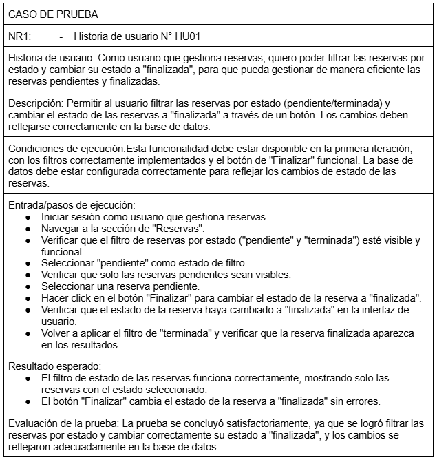
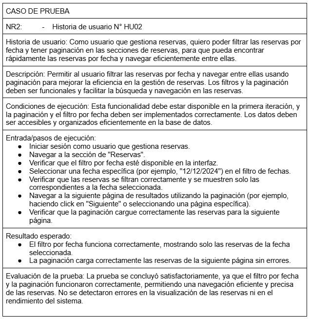
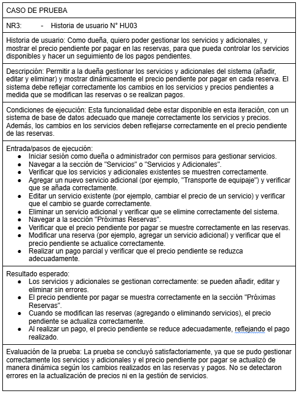
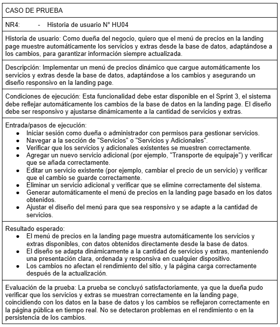
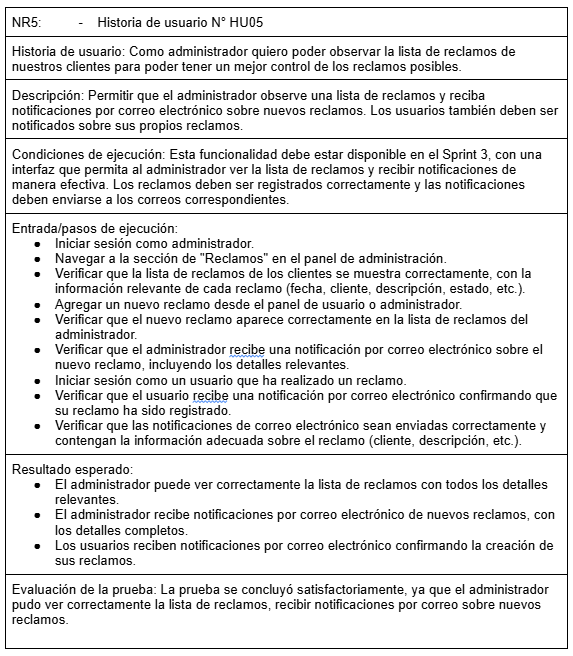

## EQUIPO XP

### Rol en XP

- **Coach**: Marjorie
  - Facilitar la adopción de XP, guiar al equipo en las mejores prácticas de desarrollo y garantizar la mejora continua.
- **Cliente**: Jhonny
  - Definir y priorizar las historias de usuario, dar retroalimentación constante y validar entregas.
- **Programadores**: Fernando, Alexia, Daniel
  - Escribir código, hacer refactorización, trabajar en pareja y asegurar la calidad del código.
- **Encargado de prueba**: Daniel
  - Escribir pruebas unitarias, de integración y de aceptación antes de escribir el código.
- **Encargado de Seguimiento (Tracker)**: Marjorie
  - Monitorización del progreso del equipo y el aseguramiento de que el proyecto se mantenga en el camino correcto para cumplir con los objetivos.
- **Consultor**: Arqque Pantigozo Antonio
  - Es un miembro externo del equipo con un conocimiento específico en algún tema necesario para el proyecto. Ayuda al equipo a resolver un problema específico.

## **Historias de Usuario y Tareas**

### **Historia de Usuario 1: HU01**

#### **Tarea TH01-1**

#### **Tarea TH01-2**

---

### **Historia de Usuario 2: HU02**

#### **Tarea TH02-1**

#### **Tarea TH02-2**

---

### **Historia de Usuario 3: HU03**

#### **Tarea TH03-1**

#### **Tarea TH03-2**

---

### **Historia de Usuario 4: HU04**

#### **Tarea TH04-1**

#### **Tarea TH04-2**

---

### **Historia de Usuario 5: HU05**

#### **Tarea TH05-1**

#### **Tarea TH05-2**

---

# PRUEBAS UNITARIAS

## Pruebas de Aceptación

### PRUEBAS FUNCIONALES:

## Caso de Prueba NR1: Historia de Usuario HU01

---

## Caso de Prueba NR2: Historia de Usuario HU02

---

## CASO DE PRUEBA NR3: Historia de usuario N° HU03

---

## CASO DE PRUEBA NR4: Historia de usuario N° HU04

---

## CASO DE PRUEBA NR5: Historia de usuario N° HU05

