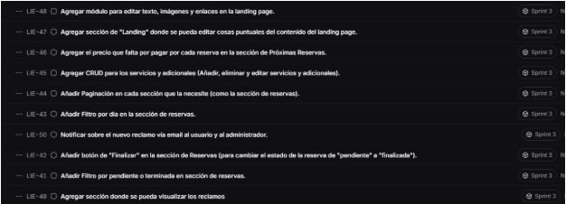
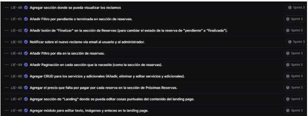

## ENTRADAS:

### Equipo Principal de Scrum:

- **Scrum Master**: Luque Cardenas Marjorie
- **Product Owner**: Tenorio Casiano Jhonny
- **Equipo de Desarrollo**:
  - Vegas Villar Fernando
  - Asuncion Pomansonco Alexia Nicol
  - Navarro Tantalean Daniel

### Sprint Backlog:

#### HISTORIA 1:

- **Tarea 1.1**: Añadir Filtro por pendiente o terminada en sección de reservas.
  - **Esfuerzo**: 3
  - **Responsable**: Fernando
  - **Prioridad**: Medio - Alta
- **Tarea 1.2**: Añadir botón de "Finalizar" en la sección de Reservas (para cambiar el estado de la reserva de "pendiente" a "finalizada").
  - **Esfuerzo**: 5
  - **Responsable**: Alexia
  - **Prioridad**: Medio - Alta

#### HISTORIA 2:

- **Tarea 2.1**: Añadir Filtro por día en la sección de reservas.
  - **Esfuerzo**: 5
  - **Responsable**: Daniel
  - **Prioridad**: Alta
- **Tarea 2.2**: Añadir Paginación en cada sección que la necesite (como la sección de reservas).
  - **Esfuerzo**: 3
  - **Responsable**: Daniel
  - **Prioridad**: Alta

#### HISTORIA 3:

- **Tarea 3.1**: Agregar CRUD para los servicios y adicionales (Añadir, eliminar y editar servicios y adicionales).
  - **Esfuerzo**: 8
  - **Responsable**: Fernando
  - **Prioridad**: Alta
- **Tarea 3.2**: Agregar el precio que falta por pagar por cada reserva en la sección de Próximas Reservas.
  - **Esfuerzo**: 5
  - **Responsable**: Daniel
  - **Prioridad**: Alta

#### HISTORIA 4:

- **Tarea 4.1**: Modificar el layout del menú de precios para que se adapte automáticamente a una cantidad dinámica de servicios y extras.
  - **Esfuerzo**: 8
  - **Responsable**: Alexia
  - **Prioridad**: Alta
- **Tarea 4.2**: Mostrar los servicios y extras leyéndolos desde la base de datos en el Landing Page.
  - **Esfuerzo**: 13
  - **Responsable**: Fernando
  - **Prioridad**: Alta

#### HISTORIA 5:

- **Tarea 5.1**: Agregar sección donde se pueda visualizar los reclamos.
  - **Esfuerzo**: 5
  - **Responsable**: Alexia
  - **Prioridad**: Media
- **Tarea 5.2**: Notificar sobre el nuevo reclamo vía email al usuario y al administrador.
  - **Esfuerzo**: 5
  - **Responsable**: Fernando
  - **Prioridad**: Media

## SCRUMBOARD:

### Impediment Log:

- Falta de coordinación para el diseño de administración para el dueño.
- Falta de claridad en los requisitos del filtro.
- Problema en la visualización del filtro en UI.

## HERRAMIENTAS:

### EXPERIENCIA DE EQUIPO:

Durante este sprint, el Product Owner ha mantenido al cliente informado mediante actualizaciones regulares, generando una mayor confianza en el progreso y la calidad del proyecto. El Scrum Master ha facilitado que el equipo se mantenga organizado y eficiente, trabajando de manera efectiva en tareas clave como el filtro por estado y el botón de "finalizar" para la gestión de reservas, así como la paginación y filtros de fecha.
El equipo ha demostrado compromiso y adaptabilidad al enfrentar desafíos técnicos, como la implementación del precio pendiente y la integración del CRUD para servicios adicionales. La coordinación constante entre el Product Owner, el Scrum Master y el equipo ha sido fundamental para resolver rápidamente cualquier impedimento, asegurando el avance del proyecto.
Este nivel de organización ha permitido que el proyecto avance conforme a los objetivos, consolidando la confianza del cliente en la entrega a tiempo y la calidad del producto final.

## SALIDAS:

### ENTREGABLE DEL SPRINT:

El equipo ha completado con éxito todas las tareas programadas en el sprint backlog, logrando los objetivos establecidos para el proyecto. Entre los entregables más importantes se incluyen:

1. **Gestión de Reservas**: Se ha implementado la funcionalidad de filtrado de reservas por estado (pendiente/terminada) y el botón de "Finalizar" para cambiar el estado de las reservas de pendiente a finalizada. Esto facilita la gestión eficiente de las reservas y asegura que los usuarios puedan llevar un seguimiento claro de su estado.
2. **Paginación y Filtros de Fecha**: Se desarrolló el filtro por fecha y la paginación en las secciones de reservas, permitiendo una navegación rápida y organizada de las reservas, mejorando la experiencia del usuario en el sistema.
3. **Gestión de Servicios y Precios Pendientes**: Se implementó el sistema CRUD para la gestión de servicios y adicionales, lo que permite al administrador añadir, editar y eliminar servicios de forma fácil. Además, el precio pendiente por pagar se muestra de manera dinámica en la sección de Próximas Reservas, facilitando el seguimiento de los pagos.
4. **Edición de la Landing Page**: Se ha diseñado e implementado una sección de "Landing" donde la dueña puede editar el contenido de la página de inicio, incluyendo texto, imágenes y enlaces, sin necesidad de intervención técnica. Esta funcionalidad garantiza que la página esté siempre actualizada según las necesidades del negocio.

### LINK DEL PROYECTO:

[https://lienzolima.com/home](https://lienzolima.com/home)

### SCRUMBOARD ACTUALIZADO:

