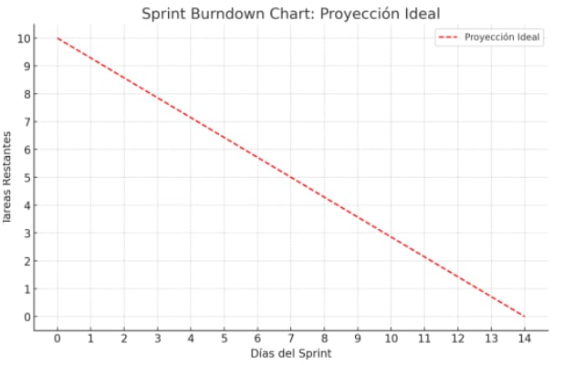
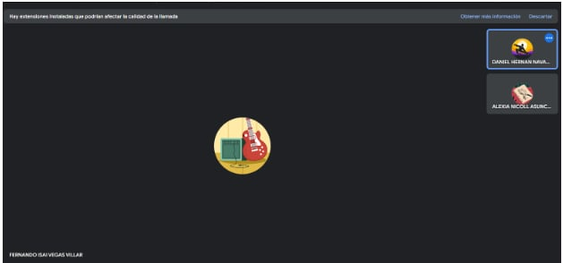

## ENTRADAS:
### Equipo Principal de Scrum:
- **Scrum Master**: Luque Cardenas Marjorie
- **Product Owner**: Tenorio Casiano Jhonny
- **Equipo de Desarrollo**:
  - Vegas Villar Fernando
  - Asuncion Pomansonco Alexia Nicol
  - Navarro Tantalean Daniel

### Scrum Master: Luque Cardenas Marjorie

### Sprint Burndown Chart:

### Impediment Log:
- Falta de coordinación para el diseño de administración para el dueño.
- Falta de claridad en los requisitos del filtro.
- Problema en la visualización del filtro en UI.

## Daily Standup:

### Tres preguntas diarias:

#### ¿Qué hicimos ayer?
- Se completaron las tareas relacionadas con la gestión de reservas, implementando correctamente el filtro por estado (pendiente/terminada) y el botón de "Finalizar" en la sección de reservas, lo que permite cambiar el estado de una reserva de pendiente a finalizada. También se completó la paginación y el filtro por fecha en la sección de reservas, mejorando la experiencia de navegación para los usuarios.

#### ¿Qué haremos hoy?
- Hoy vamos a trabajar en la implementación de la gestión de servicios y adicionales, creando la interfaz para que el administrador pueda añadir, editar y eliminar servicios. Además, se verificará que el precio pendiente se actualice dinámicamente en la sección de Próximas Reservas cada vez que se realice un pago.

#### ¿Qué dificultades tuvimos?
- Tuvimos algunos desafíos al integrar el sistema de paginación en la sección de reservas, especialmente al manejar grandes volúmenes de datos. También hubo pequeños ajustes necesarios para que el precio pendiente se mostrará correctamente y se actualizara en tiempo real en la interfaz.

## SALIDAS:
### SPRINT BURNDOWN CHART ACTUALIZADO:
[Imagen actualizada del gráfico de Burndown Chart]

### Impediment Log Actualizado:
- Falta de coordinación para el diseño de administración para el dueño.
- Falta de claridad en los requisitos del filtro.
- Problema en la visualización del filtro en UI.
