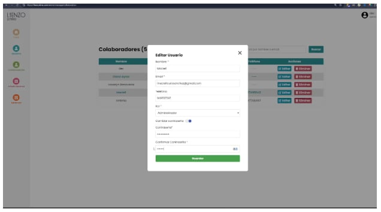
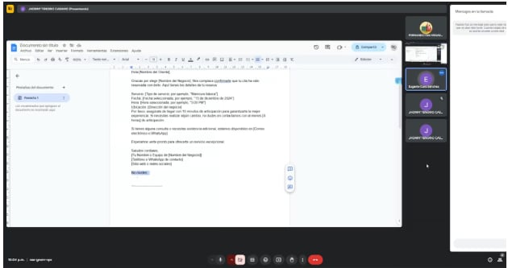

## ENTRADAS:
### Equipo Principal de Scrum:
- **Scrum Master**: Luque Cardenas Marjorie
- **Product Owner**: Tenorio Casiano Jhonny
- **Equipo de Desarrollo**:
  - Vegas Villar Fernando
  - Asuncion Pomansonco Alexia Nicol
  - Navarro Tantalean Daniel

### Entregables del Sprint:

#### Historias de Usuario y Criterios de Aceptación:

- **Historia 1**: Como usuario que gestiona reservas quiero poder filtrar las reservas por estado y cambiar su estado a "finalizada" para que pueda gestionar de manera eficiente las reservas pendientes y finalizadas.
  - **Criterios de Aceptación**:
    1. El sistema debe permitir filtrar las reservas por estado (pendiente/terminada) en la sección de reservas.
    2. El botón de "Finalizar" debe permitir cambiar el estado de una reserva de "pendiente" a "finalizada", y este cambio debe reflejarse correctamente en la base de datos.

- **Historia 2**: Como usuario que gestiona reservas quiero poder filtrar las reservas por fecha y tener paginación en las secciones de reservas, para que pueda encontrar rápidamente las reservas por fecha y navegar eficientemente entre ellas.
  - **Criterios de Aceptación**:
    1. El sistema debe permitir filtrar las reservas por fecha, ya sea seleccionando un día específico o un rango de fechas.
    2. Las secciones que contienen muchas reservas deben tener paginación implementada, permitiendo navegar entre varias páginas de resultados de manera eficiente.

- **Historia 3**: Como dueña quiero poder gestionar los servicios y adicionales, y mostrar el precio pendiente por pagar en las reservas para que pueda controlar los servicios disponibles y hacer un seguimiento de los pagos pendientes.
  - **Criterios de Aceptación**:
    1. El precio pendiente debe mostrarse junto a cada reserva en la sección de Próximas Reservas, y debe actualizarse dinámicamente a medida que se realicen pagos.
    2. Se debe permitir al administrador añadir, editar y eliminar servicios y adicionales desde una interfaz de gestión en el sistema.

- **Historia 4**: Como dueña quiero poder editar el contenido de la landing page para que pueda actualizar fácilmente la información visible para los usuarios sin necesidad de intervención técnica.
  - **Criterios de Aceptación**:
    1. El sistema debe permitir editar el contenido de la landing page, incluyendo texto, imágenes y enlaces.
    2. Los cambios realizados en la landing page deben reflejarse de inmediato en el sitio público sin necesidad de despliegue adicional.

- **Historia 5**: Como administrador quiero poder observar las listas de reclamos de nuestros clientes para poder tener un mejor control de los reclamos posibles.
  - **Criterios de Aceptación**:
    1. La vista de los reclamos debe estar visible en todo momento y deben reflejarse de manera inmediata.
    2. Se debe poder enviar correos de confirmación tanto al cliente como administrador.

## SPRINT BACKLOG:
| HISTORIA | TAREA                                                                                     | ESFUERZO | RESPONSABLE   | PRIORIDAD      |
|----------|-------------------------------------------------------------------------------------------|----------|---------------|----------------|
| **Historia 1** | **Tarea 1.1**: Añadir Filtro por pendiente o terminada en sección de reservas            | 3        | Fernando      | Medio - Alta   |
|          | **Tarea 1.2**: Añadir botón de "Finalizar" en la sección de Reservas                       | 5        | Alexia        | Medio - Alta   |
| **Historia 2** | **Tarea 2.1**: Añadir Filtro por día en la sección de reservas                           | 5        | Daniel        | Alta           |
|          | **Tarea 2.2**: Añadir Paginación en cada sección que la necesite                           | 3        | Daniel        | Alta           |
| **Historia 3** | **Tarea 3.1**: Agregar CRUD para los servicios y adicionales (Añadir, eliminar y editar servicios y adicionales) | 8        | Fernando      | Alta           |
|          | **Tarea 3.2**: Agregar el precio que falta por pagar por cada reserva en la sección de Próximas Reservas | 5        | Daniel        | Alta           |
| **Historia 4** | **Tarea 4.1**: Agregar sección de "Landing" donde se pueda editar cosas puntuales del contenido del landing page | 8        | Alexia        | Alta           |
|          | **Tarea 4.2**: Agregar módulo para editar texto, imágenes y enlaces en la landing page     | 13       | Fernando      | Alta           |
| **Historia 5** | **Tarea 5.1**: Agregar sección donde se pueda visualizar los reclamos                    | 5        | Alexia        | Media          |
|          | **Tarea 5.2**: Notificar sobre el nuevo reclamo vía email al usuario y al administrador   | 5        | Fernando      | Media          |

## CRITERIOS DE TERMINADO:
1. **Funcionalidad Completada**: La historia de usuario debe cumplir con todos los requerimientos funcionales establecidos en los criterios de aceptación. El software debe funcionar como se espera en todos los casos de uso definidos, y las características deben estar implementadas correctamente sin errores.
2. **Pruebas Completadas**: Todas las pruebas automatizadas (unitarias, de integración, y de aceptación) deben ejecutarse correctamente. Esto asegura que la nueva funcionalidad no cause errores en otras partes del sistema y que cumpla con los requisitos del usuario.
3. **Revisión de Código Realizada**: El código fuente debe ser revisado por otro miembro del equipo para verificar su calidad y mantenibilidad. Durante la revisión se deben identificar posibles problemas de diseño, optimización, o errores que no hayan sido detectados durante el desarrollo.
4. **Documentación Técnica Actualizada**: Toda la documentación técnica relacionada con el software debe ser actualizada. Esto incluye los cambios en el código, nuevas funcionalidades, y cualquier ajuste en la base de datos o la arquitectura del sistema. La documentación debe estar clara para futuros desarrollos o mantenimiento.

## REVISIÓN DE LAS HISTORIAS DE USUARIO Y CRITERIOS DE ACEPTACIÓN:

| **Historia de Usuario**                                                                                                                                   | **Criterios de Aceptación**                                                                                                                                       | **Estado**    |
|---------------------------------------------------------------------------------------------------------------------------------------------------------|------------------------------------------------------------------------------------------------------------------------------------------------------------------|---------------|
| **Historia 1**: Como usuario que gestiona reservas quiero poder filtrar las reservas por estado y cambiar su estado a "finalizada" para gestionar las reservas. | El sistema debe permitir filtrar las reservas por estado. El botón "Finalizar" debe cambiar el estado de una reserva de "pendiente" a "finalizada".               | Aceptada      |
| **Historia 2**: Como usuario que gestiona reservas quiero filtrar las reservas por fecha y tener paginación.                                               | El sistema debe permitir filtrar por fecha. Las secciones con muchas reservas deben tener paginación implementada.                                               | Aceptada      |
| **Historia 3**: Como dueña quiero gestionar servicios y mostrar el precio pendiente en las reservas.                                                       | El precio pendiente debe mostrarse en "Próximas Reservas", y debe actualizarse con cada pago. El administrador debe poder gestionar servicios y adicionales.        | Aceptada      |
| **Historia 4**: Como dueña quiero poder editar el contenido de la landing page.                                                                           | El sistema debe permitir editar el contenido de la landing page. Los cambios deben reflejarse inmediatamente sin necesidad de despliegue adicional.                 | Aceptada      |
| **Historia 5**: Como administrador quiero observar las listas de reclamos.                                                                               | La vista de los reclamos debe ser visible en todo momento. Se debe enviar correos de confirmación a cliente y administrador.                                      | Aceptada      |

## HERRAMIENTAS:
### REUNIÓN DE REVISIÓN DEL SPRINT:
Revisión general de lo que se estuvo desarrollando, validación de funcionalidades, y aceptación de entregables.

### ENTREGABLES ACEPTADOS:
| **Historia de Usuario**                                                                                                                                                       | **Criterios de Aceptación**                                                                                                                                                                | **Aceptado** | **Rechazado** |
|------------------------------------------------------------------------------------------------------------------------------------------------------------------------------|-----------------------------------------------------------------------------------------------------------------------------------------------------------------------------------------|--------------|---------------|
| **Historia 1**: Como usuario que gestiona reservas quiero poder filtrar las reservas por estado y cambiar su estado a "finalizada" para que pueda gestionar de manera eficiente las reservas pendientes y finalizadas. | 1. El sistema debe permitir filtrar las reservas por estado (pendiente/terminada) en la sección de reservas.   2. El botón de "Finalizar" debe permitir cambiar el estado de una reserva de "pendiente" a "finalizada", y este cambio debe reflejarse correctamente en la base de datos. | X            |               |
| **Historia 2**: Como usuario que gestiona reservas quiero poder filtrar las reservas por fecha y tener paginación en las secciones de reservas, para que pueda encontrar rápidamente las reservas por fecha y navegar eficientemente entre ellas. | 1. El sistema debe permitir filtrar las reservas por fecha, ya sea seleccionando un día específico o un rango de fechas.   2. Las secciones que contienen muchas reservas deben tener paginación implementada, permitiendo navegar entre varias páginas de resultados de manera eficiente. | X            |               |
| **Historia 3**: Como dueña quiero poder gestionar los servicios y adicionales, y mostrar el precio pendiente por pagar en las reservas para que pueda controlar los servicios disponibles y hacer un seguimiento de los pagos pendientes. | 1. El precio pendiente debe mostrarse junto a cada reserva en la sección de Próximas Reservas, y debe actualizarse dinámicamente a medida que se realicen pagos.   2. Se debe permitir al administrador añadir, editar y eliminar servicios y adicionales desde una interfaz de gestión en el sistema. | X            |               |
| **Historia 4**: Como dueña quiero poder editar el contenido de la landing page para que pueda actualizar fácilmente la información visible para los usuarios sin necesidad de intervención técnica. | 1. El sistema debe permitir editar el contenido de la landing page, incluyendo texto, imágenes y enlaces.   2. Los cambios realizados en la landing page deben reflejarse de inmediato en el sitio público sin necesidad de despliegue adicional. | X            |               |
| **Historia 5**: Como administrador quiero poder observar las listas de reclamos de nuestros clientes para poder tener un mejor control de los reclamos posibles. | 1. La vista de los reclamos debe estar visible en todo momento y deben reflejarse de manera inmediata.   2. Se debe poder enviar correos de confirmación tanto al cliente como administrador. | X            |               |

